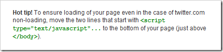

Twitter (read more about Twitter [here](/archive/2008/04/28/thoughts-on-twitter)) offers a [simple JavaScript API](http://twitter.com/widgets/html_widget) to add your status updates to your blog or other website.
  
## The Problem
  
Injecting HTML into a webpage like this works well enough for the most part put it can produce problems if the website you are getting HTML from, Twitter in this case, is slow or unreliable. An inline script reference will hang the rendering of the page at that point until a response is returned.
  
If Twitter.com is down, [not an uncommon occurrence](http://failwhale.com/), and you have an inline script reference like the one above then your website is essentially broken until Twitter fixes itself.
  


To get around this problem Twitter advises that the script reference should be placed at the end of a page. That fixes one issue but creates another: The content from Twitter pops into the page only once the page is completely loaded. It looks a little hacky at best and could cause the content on the page to suddenly move and reflow depending upon where the Twitter statuses are being inserted.
  
An example of content pop-in can be seen in the sidebar of [MajorNelson](http://www.majornelson.com/)’s blog. Each time the page reloads there is a noticeable delay before the Twitter statues are populated.
  
## The Solution
  
My solution is simple: cache the result from Twitter in a cookie. Placing the script reference at the bottom of the page gets around the issue of a broken website and caching the result means no content pop-in after the first page view.
  
The JavaScript is pretty simple.
  
```csharp
<script type="text/javascript">
  function setCookie(name, value, expires) {
    document.cookie = name + "=" + escape(value) + "; path=/" + ((expires == null) ? "" : "; expires=" + expires.toGMTString());
  }

  function getCookie(name) {
    if (document.cookie.length > 0) {
      var start = document.cookie.indexOf(name + "=");
      if (start != -1) {
        start = start + name.length + 1;
        var end = document.cookie.indexOf(";", start);
        if (end == -1) {
          end = document.cookie.length;
        }
        return unescape(document.cookie.substring(start, end));
      }
    }
    return "";
  }

  function twitterCachedCallback(c) {
    // this will create the HTML. Function found inside blogger.js
    twitterCallback2(c);

    var content = document.getElementById("twitter_update_list").innerHTML;

    // expire cookie after 30 minutes
    var exp = new Date();
    exp.setTime(exp.getTime() + (1000 * 60 * 30));
    setCookie('twitter_content', content, exp);
  }

  // set content immediately if cached
  var cachedContent = getCookie('twitter_content');
  if (cachedContent) {
    document.getElementById("twitter_update_list").innerHTML = cachedContent;
  }
</script>
```

Add this script immediately after the Twitter content. If cached content is found then it will be inserted into the page straight away, improving user experience.

The only other change that needs to be made is to the script reference to Twitter. Rename the callback function from twitterCallback2 to twitterCachedCallback in the querystring and you’re done.

I use this technique on my blog (look to the sidebar on the right). You can also see an example webpage I threw together [**here**](/blogfiles/twittercaching/twittercaching.html).