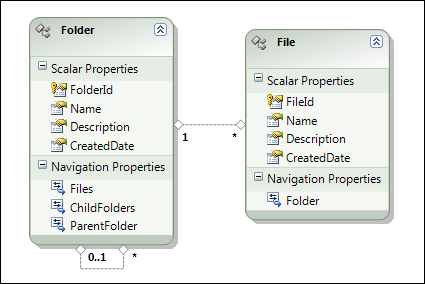

I sat down today resolved to finally add support for serializing [ADO.NET Entities](http://msdn.microsoft.com/en-us/data/aa937723.aspx) objects… and instead I came away surprised to find that it already worked. My initial “Lets prove it breaks first and then fix it” test passed first time and it wasn't until I debugged through the test that I was convinced NUnit wasn't the one that was broken.
  
My simple test Entities model of a file system:
  


And the JSON serialized with a couple of folders and files in it:
  
```csharp
Folder rootFolder = CreateEntitiesTestData();

string json = JsonConvert.SerializeObject(rootFolder, Formatting.Indented);

Console.WriteLine(json);
//{
//  "$id": "1",
//  "FolderId": "a4e8ba80-eb24-4591-bb1c-62d3ad83701e",
//  "Name": "Root folder",
//  "Description": null,
//  "CreatedDate": "\/Date(978087000000)\/",
//  "Files": [],
//  "ChildFolders": [
//    {
//      "$id": "2",
//      "FolderId": "484936e2-7cbb-4592-93ff-b2103e5705e4",
//      "Name": "Child folder",
//      "Description": null,
//      "CreatedDate": "\/Date(978087000000)\/",
//      "Files": [
//        {
//          "$id": "3",
//          "FileId": "cc76d734-49f1-4616-bb38-41514228ac6c",
//          "Name": "File 1.txt",
//          "Description": null,
//          "CreatedDate": "\/Date(978087000000)\/",
//          "Folder": {
//            "$ref": "2"
//          }
//        }
//      ],
//      "ChildFolders": [],
//      "ParentFolder": {
//        "$ref": "1"
//      }
//    }
//  ],
//  "ParentFolder": null
//}
```

That looks pretty good!

Features added in Beta 4, reference tracking and support for the [DataContract](http://msdn.microsoft.com/en-us/library/system.runtime.serialization.datacontractattribute.aspx)/[DataMember](http://msdn.microsoft.com/en-us/library/system.runtime.serialization.datamemberattribute.aspx) attributes from WCF, means that instead of Json.NET exploding in a heap of timber (complete with lone wagon wheel spinning off into the distance) at the mere site of an ADO.NET Entities object, serializing now works out of the box!

I love it when things come together 😊