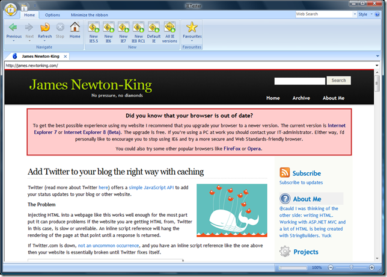

IE7 has been out for two and a half years. It is time to [stop living in the past](http://www.stoplivinginthepast.com/) and [retire](http://en.wikipedia.org/wiki/Blade_Runner) IE6.
  
## IETester
  
As an aside I highly recommend [IETester](http://www.my-debugbar.com/wiki/IETester/HomePage) (see the screenshot above) to anyone needing to test websites in old versions of IE. It renders IE 5.5, 6, 7 and 8 side by side in one application. It even supports tabs!