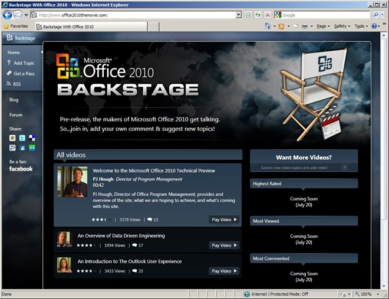
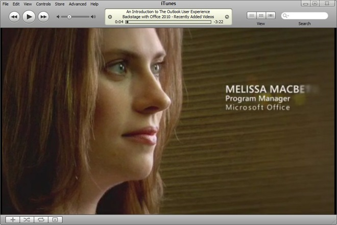
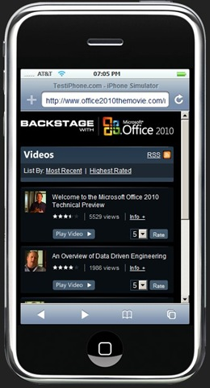

The past two weeks I have been working long hours with a small band from [Intergen](http://www.intergen.co.nz/) on the Backstage With Office 2010 website. I can happily say that today [Backstage](http://www.office2010themovie.com/) went live with the unveiling of [Microsoft Office 2010](http://www.microsoft.com/office/2010/)!
  
Backstage is full of videos from the Office 2010 team who go behind the scenes of Office development and talk about what they have been busy working on since 2007. The main Backstage website is 100% Silverlight shows off lots of neat features.
  
- 100% Silverlight design
- [Smooth streaming](http://www.iis.net/extensions/SmoothStreaming) - videos will scale from HD for awesome broadband connections down to speed optimized resolutions for mobile devices
- Embedded social links to those sites all the cool kids are using (Twitter, Facebook, Delicious, Digg, Live)
- Deep linking directly to videos
- Commenting and rating videos, video view counts

As well as the main site we have created an [RSS feed](http://www.office2010themovie.com/rss/) of recently added videos. Not only can you subscribe to it an RSS reader but the feed also works with iTunes and other video podcast clients.
  

Finally visiting mobile users will automatically be redirect to an HTML [mobile version of the site](http://www.office2010themovie.com/mobile/), complete with low resolution videos for 3G mobile devices. It looks fantastic on my iPhone.
  

Its been a crazy ride getting everything done in time for the launch but I think the end result was worth it. Check out Backstage With Office 2010 [here](http://www.office2010themovie.com/).