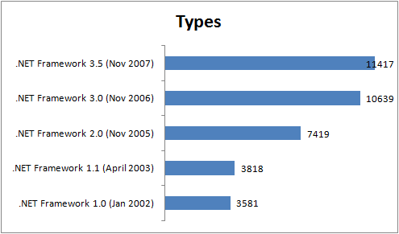

Intergenite [Andrew Tokeley](http://www.andrewtokeley.net) recently [blogged](http://www.andrewtokeley.net/archive/2008/03/17/being-a-microsoft-developer.aspx) about how a Microsoft developer has to know so much more to be considered a senior dev (or even intermediate!) compared to just 5 years ago.
 
This graph of the number .NET types in the framework made by [Brad Abrams](http://blogs.msdn.com/brada/archive/2008/03/17/number-of-types-in-the-net-framework.aspx) illustrates the point pretty well:
 

I started .NET development in 2003 with .NET 1.1. Fast forward to 2008 and the number of types in the .NET framework has tripled!
 
Remembering how overwhelmed I felt when I first approached .NET back in 2003, I can't imagine how a junior developer today must feel.