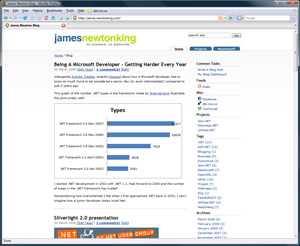
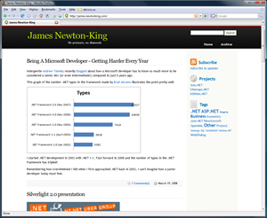

If you regularly visit my blog ([subscribe already!](http://feeds.feedburner.com/jamesnewtonking)) you may have noticed the design has been updated.
 
Here is a comparison between the old and the new. Click for a bigger image:
 
   
 
I threw out the old design and started with a template called [EliteCircle](http://www.styleshout.com/templates/preview/EliteCircle1-1/index.html), which I have made some fairly substantial updates to. I was a little hesitant about changing the CSS too much, the last time I had done any serious CSS work was over two years ago, but everything ending up going smoothly.
 
## Changes
 
The previous look was simple which I liked, but it was gradually getting overrun by tag and archive links. Tags are now displayed in a screen real estate efficient cloud, and archive links have been moved to a [separate page](/archive).
 
The design is slightly wider. The previous design's minimum resolution was 800x600, which according to [Google Analytics](http://www.google.com/analytics/) is used by just 0.3% of visitors these days. The new minimum resolution is now 1024x768. With the wider design I have increased the content text to match.
 
In the new design I have also removed a lot of what I think is unnecessary information from the blog. The focus of a blog should be the content. Details like what categories a post is in or exactly what time a comment was made aren't of interested to the average visitor and have been removed to reduce screen clutter.
 
Overall I am really happy with the new design and I think it is a big improvement over what was here before.
 
## Obligatory
 
As always with a redesign, if you spot anything weird or broken, or just think something looks bad, let me know. Thanks!