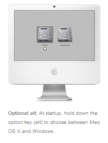

Apple's announcement and release of [Boot Camp](http://www.apple.com/macosx/bootcamp/), a utility allowing the dual booting of Windows on Intel-based Mac hardware [has](http://apple.slashdot.org/apple/06/04/05/136253.shtml) [certainly](http://www.gavinshearer.com/weblog/archives/2006/04/the_first_boot.html) [caused](http://daringfireball.net/2006/04/windows_the_new_classic) [quite](http://scobleizer.wordpress.com/2006/04/05/run-xp-on-a-mac-cool/) [a](http://www.nytimes.com/2006/04/07/opinion/07fri4.html?_r=1&amp;oref=login) [stir](http://tech.memeorandum.com/060405/p28#a060405p28), and for good reason. These are some thoughts on what Boot Camp will mean for those with a proclivity for one button mice and grayscale images. In particular, the effect of Mac users increased accessibility to Windows software on Mac developers.

## Mac Users

This release is obviously good news for existing Apple users. With Intel Macs now able to run Windows the barrier to running Windows applications has fallen dramatically. A $199 Windows license is a lot less than a $1000 PC. Boot Camp means Apple users will now have easy access to Window's huge library of applications and games, some of which previously wouldn't have had an equivalent on Mac because of Apple's smaller market share.

## Apple Computers, Inc

Apple will also see benefit from Boot Camp, I believe in the form of a slow steady growth in market share. John Gruber wrote an [excellent post](http://daringfireball.net/2006/04/windows_the_new_classic) looking at Boot Camp's release and made an interesting statement about how Mac's are no longer different, they're special. They can run both Windows and OS X. The enthusiast running Windows, who previously would never have considered a Mac because it didn't have X game or Y application, would now give buying Apple hardware some serious consideration. I expect this will be a gradual process, happening as user's look around when upgrading their current computers, rather than a sudden rush.

While the bump in growth from Boot Camp could be slow, I think it will be very good news for Apple as these users will be the best kind to get. Enthusiasts are the people that run websites and have (popular) blogs. They are the movers and shakers of the Window's world. Tyhco and Gabe of [Penny-Arcade](http://www.penny-arcade.com/) for example both recently [purchased](http://www.penny-arcade.com/comic/2006/03/03) Macs and have [waxed lyrical](http://www.penny-arcade.com/2006/03/06) on the subject to an audience of god knows how many people. Having influential customers is never a bad thing.

So is Boot Camp a home run for the world for the world of Mac computers? In my opinion, not quite.

## Mac Developers

While the lower barrier for Apple user's to run Windows applications will lead to growth in the share of users running Apple hardware, overall the effect on Mac developers will probably negative. The reason? In a word: [Competition](http://en.wikipedia.org/wiki/Competition#Economics_and_business_competition).

Apple has a [significantly](http://www.siliconvalley.com/mld/siliconvalley/business/columnists/mike_langberg/14191452.htm) smaller install base than Windows, which translates into a smaller potential market for software that targets OS X. To Mac users the most obvious effect of the smaller market is that software available on Windows, some niche application for example, might not be available for Macs. The market just isn't large enough to make developing it on OS X commercially viable.

Since there are no Mac developers producing those very niche market applications there is no harm done by making it easier for users to use with Windows. However the other effect of the smaller market is that where software applications are available on OS X, the range of choice is not as great as it is on Windows.

In other words there are less developers competing with one another. Where there could be dozens of an application on Windows for some specific task, there may only be a handful on OS X; and where there are only a handful on Windows there may be just one choice on for the Mac.

Where previously a Mac developer might have been able to charge a premium for his software, possibly because his was the only one for Macs that had a certain feature, he will now have to be much more aware of what the price of the equivalent software on Windows is. Charge too much and he'll lose sales as user's who were previously restricted to Mac software by the high cost of buying a separate PC will now buy the Windows version instead. Without the previous premium will he be able to survive? Is it worth him to continue making software targeting OS X given its small install base and the increased competition from the comparatively cut throat world of Windows applications? Time will tell.

## Final thought:

Apple hardware is now special. It can run on both Windows and OS X. But by the same logic that also means Windows software is special because it can run on both types of hardware. Supposing Apple continues to improve its integration with Windows beyond dual booting to the point where Windows software can run within OS X, where does that leave Mac software?