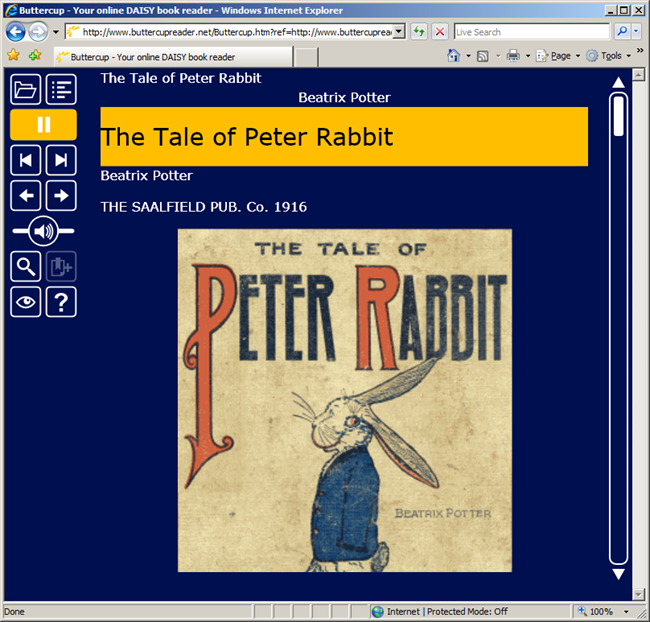

For the second Mix in a row [Intergen](http://www.intergen.co.nz/) is launching a cool new Silverlight application: [ButtercupReader](http://www.buttercupreader.net/)!
  
ButtercupReader is a free Silverlight 2.0 application for viewing and playing digital talking books ([DAISY](http://www.daisy.org/)) on the web by blind and partially sighted users.
  
As well as using Silverlight to render text and play DAISY document audio, ButtercupReader also showcases many of Silverlight's accessibility features including screen reader support, shortcut keys, different contrast settings and zoomability. [Andrew Tokeley](http://andrewtokeley.net/), a member of the ButtercupReader team, has a great blog post on those features [here](http://andrewtokeley.net/archive/2009/03/18/what-do-silverlight-accessibility-and-buttercups-having-in-common.aspx).
  
I only worked briefly on this project, spiking out functionality at the beginning. It is great to see how it has all come together.
  
