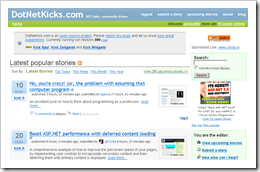

 For anyone who hasn't heard about this site yet, [DotNetKicks.com](http://www.dotnetkicks.com/) is a community based news website. Basically it is a lot like Digg in that users submit and vote on articles, but unlike Digg it is focused exclusively on .NET news.
 
Because the readers of DotNetKicks.com are all .NET developers, and they are the people that vote on what is important, you can be sure that the quality of articles that appears will always be high. Any important news or useful new tool will be sure to find its way onto the front page. You can keep up with .NET without being subscribed to a 100 different blogs
 
If you have your own blog DotNetKicks.com can also be a great way to grow your readership. As a member you can submit your own blog posts for users to vote on. If the users find it interesting and "kick it" it will move onto the front page. A whole new community will be visiting your blog.
 
[DotNetKicks.com](http://www.dotnetkicks.com/)
 
[DotNetKicks.com Feed](http://feeds.feedburner.com/dotnetkicks)

 \*
 
\* The HTML for this button is generated by DotNetKicks.com when you submit a story.