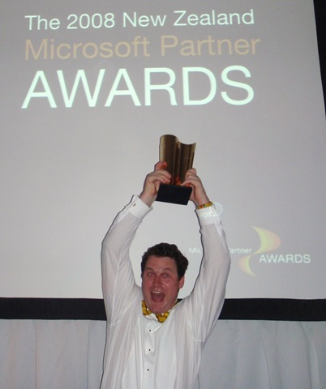

Last night [Intergen](http://www.intergen.co.nz/), my most excellent employer, won Microsoft Partner Of The Year Award for New Zealand.
 
Microsoft said we won the award because of our commitment to delivering solutions to our clients across the entire Microsoft Application Stack. Intergen was recognised as the only partner who can truly offer solutions that span the breadth from .NET development through MOSS, BI, CRM, NAV etc. Special mention was also made of the work we did in support of the [Office Open XML standard](/archive/tags/OpenXML/default.aspx).
 
[Chris](http://www.syringe.net.nz/) was on hand to accept the award. He was rather blasé about the whole thing...
 
