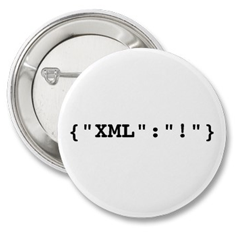

[JSON's](http://www.json.org/) popularity continues to grow. In the few months since Json.NET 2.0 was released it has been downloaded over 5000 times and lots of new feedback has been posted in project's forum. This release of Json.NET adds heaps of new features, mostly from your suggestions, and fixes all known bugs!
 
## Silverlight Support
 
Json.NET now supports running on the browser within [Silverlight](http://silverlight.net/). The download includes Newtonsoft.Json.Silverlight.dll which can be referenced from Silverlight projects.
 
The Silverlight build the library shares the same source code as Json.NET and it is identical to use.
 
## LINQ to JSON even easier to use
 
There have been lots of little changes to LINQ to JSON in this release but the main one in Json.NET 3.0 is that the two primary classes now implement common .NET collection interfaces.
 
JObject implements [IDictionary&lt;TKey, TValue&gt;](http://msdn.microsoft.com/en-us/library/s4ys34ea.aspx) and JArray implements [IList&lt;T&gt;](http://msdn.microsoft.com/en-us/library/5y536ey6.aspx). Working with these classes is now just like any other list or dictionary!
 
## Serializer Improvements
 
Along with incorporating many small improvements, the big new addition to the Json.NET 3.0 serializer is JsonConverterAttribute.
 
JsonConverterAttribute can be placed on a class and defines which JsonConverter you always want to use to serialize this class with instead of using the default serializer logic.
 
JsonConverterAttribute can also be placed on a field or property to specify which converter you want to use to serialize that specific member.
  
```csharp
public class Person
{
  // "John Smith"
  public string Name { get; set; }

  // "2000-12-15T22:11:03"
  [JsonConverter(typeof(IsoDateTimeConverter))]
  public DateTime BirthDate { get; set; }

  // new Date(976918263055)
  [JsonConverter(typeof(JavaScriptDateTimeConverter))]
  public DateTime LastModified { get; set; }
}
```

## Changes

Here is a complete list of what has changed.

- New feature - Silverlight Json.NET build.
- New feature - JObject now implements IDictionary, JArray now implements IList.
- New feature - Added JsonConverterAttribute. Used to define a JsonConverter to serialize a class or member. Can be placed on classes or fields and properties.
- New feature - Added DateTimeFormat to IsoDateTimeConverter to customize date format.
- New feature - Added WriteValue(object) overload to JsonWriter.
- New feature - Added JTokenEqualityComparer.
- New feature - Added IJEnumerable. JEnumerable and JToken now both implement IJEnumerable.
- New feature - Added AsJEnumerable extension method.
- Change - JsonSerializer does a case insensitive compare when matching property names and constructor params.
- Change - JObject properties must have a unique name.
- Bug fix - Internal string buffer properly resizes when parsing long JSON documents.
- Bug fix - JsonWriter no longer errors in certain conditions when writing a JsonReader's position.
- Bug fix - JsonSerializer skips multi-token properties when putting together constructor values.
- Bug fix - Change IConvertible conversions to use ToXXXX methods rather than casting.
- Bug fix - GetFieldsAndProperties now properly returns a distinct list of member names for classes than have overriden abstract generic properties.

## Donate

You can now support Json.NET by donating. Json.NET is a free open source project and is developed in personal time.

[](https://www.paypal.com/cgi-bin/webscr?cmd=_donations&amp;business=james%40newtonking%2ecom&amp;item_name=Supporting%20Json%2eNET&amp;no_shipping=0&amp;no_note=1&amp;tax=0&amp;currency_code=USD&amp;lc=US&amp;bn=PP%2dDonationsBF&amp;charset=UTF%2d8) 

## Links

[**Json.NET CodePlex Project**](http://www.codeplex.com/json)

[**Json.NET 3.0 Download**](http://www.codeplex.com/Json/Release/ProjectReleases.aspx?ReleaseId=16593) - Json.NET source code and binaries