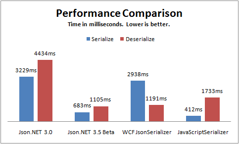

I am starting to get organised towards releasing Json.NET 3.5. There are a lot of good new features coming in this version, almost all of them driven by user requests.
  
## Compact Framework Support
  
Json.NET 3.5 includes a build for the [Compact Framework 3.5](http://msdn.microsoft.com/en-us/netframework/aa497273.aspx). It supports all the major features of Json.NET.
  
## Performance Improvements
  
A lot of features have been added to [Json.NET](http://www.newtonsoft.com/json) over the past couple of years and it has been a long time since I had done any performance tuning.
  
I busted out a profiler and found some big gains in the JsonSerializer by doing some basic caching of type data. I managed to eek out a 400% increase in performance. Not bad for 20 minutes work.
  
Below is a comparison of Json.NET 3.0, Json.NET 3.5 Beta 1, the WCF [DataContractJsonSerializer](http://msdn.microsoft.com/en-us/library/system.runtime.serialization.json.datacontractjsonserializer.aspx) and the [JavaScriptSerializer](http://msdn.microsoft.com/en-us/library/system.web.script.serialization.javascriptserializer.aspx). The code for the results is in the PerformanceTests class and is over 5000 iterations.
  
 
  
## JsonSerializerSettings
  
There are a lot of settings on JsonSerializer but only a few of them are exposed through the JavaScriptConvert.SerializeObject/DeserializeObject helper methods. To make those options available through the easy to use helper methods I have added the JsonSerializerSettings class along with overloads using it to the helper methods.
  
```csharp
public class Invoice
{
  public string Company { get; set; }
  public decimal Amount { get; set; }
  [DefaultValue(false)]
  public bool Paid { get; set; }
  [DefaultValue(null)]
  public DateTime? PaidDate { get; set; }
}
```

This example of the JsonSerializerSettings also shows another new feature of Json.NET 3.5: DefaultValueHandling. If the property value is the same as the default value then those values will be skipped when writing JSON.

```csharp
public void SerializeInvoice()
{
  Invoice invoice = new Invoice
                    {
                      Company = "Acme Ltd.",
                      Amount = 50.0m,
                      Paid = false
                    };

  string json = JavaScriptConvert.SerializeObject(invoice);

  Console.WriteLine(json);
  // {"Company":"Acme Ltd.","Amount":50.0,"Paid":false,"PaidDate":null}

  json = JavaScriptConvert.SerializeObject(invoice,
    Formatting.None,
    new JsonSerializerSettings { DefaultValueHandling = DefaultValueHandling.Ignore });

  Console.WriteLine(json);
  // {"Company":"Acme Ltd.","Amount":50.0}
}
```

## Writing Raw JSON

For a long time JsonWriter has had a WriteRaw method. I can proudly say that now it actually works. Serializing raw JSON is also much improved with the new JsonRaw object.

## Changes

Here is a complete list of what has changed.

- New feature - Compact framework support
- New feature - Big serializer performance improvements through caching of static type data
- New feature - Added DefaultValueHandling option to JsonSerializer
- New feature - JsonSerializer better supports deserializing into ICollection&lt;T&gt; objects
- New feature - Added JsonSerializerSettings class along with overloads to JavaScriptConvert serialize/deserialize methods
- New feature - IsoDateTimeConverter and JavaScriptDateTimeConverter now support nullable DateTimes
- New feature - Added JsonWriter.WriteValue overloads for nullable types
- New feature - Newtonsoft.Json.dll is now signed
- New feature - Much better support for reading, writing and serializing raw JSON
- New feature - Added JsonWriter.WriteRawValue
- Change - Renamed Identifier to JsonRaw
- Change - JSON date constructors deserialize to a date
- Fix - JavaScriptConvert.DeserializeObject checks for addition content after deserializing an object
- Fix - Changed JsonSerializer.Deserialize to take a TextReader instead of a StringReader
- Fix - Changed JsonTextWriter.WriteValue(string) to write null instead of an empty string for a null value
- Fix - JsonWriter.WriteValue(object) no longer errors on a null value
- Fix - Corrected JContainer child ordering when adding multi values

## Links

[**Json.NET CodePlex Project**](http://www.codeplex.com/json)

[**Json.NET 3.5 Beta 1 Download**](http://www.codeplex.com/Json/Release/ProjectReleases.aspx?ReleaseId=18825) - Json.NET source code, documentation and binaries