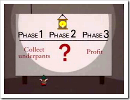

1. 

   Best. Serializer. Ever.
2. [???](http://en.wikipedia.org/wiki/Gnomes_%28South_Park%29)
3. Profit!

## JsonSerializer Improvements Part Deux

A huge amount has changed in the [Json.NET](http://www.newtonsoft.com/json) serializer since beta 3. As well as a general refactor (the JsonSerializer.cs file was pushing 1000 lines last release), tons and tons of new features have been added.

New to the serializer is reference tracking, type tracking, serialization callback events, [MetadataTypeAttribute](http://msdn.microsoft.com/en-us/library/system.componentmodel.dataannotations.metadatatypeattribute.aspx) support for when working with code generation, additional property level control over serialization settings, a BinaryConverter to convert byte arrays, a StringEnumConverter to convert enum values to their string name, a Populate method for populating JSON values onto an existing object, additional programmatic control over serialization via the IReferenceResolver interface (it replaces [IMappingResolver](/archive/2009/02/28/thoughts-on-improving-jsonserializer-imappingresolver)), and much more…

There is too much to cover in one blog post so I’m going to split everything up over a couple of weeks. If you’re really eager for the inside scoop then check out the [Json.NET help](http://www.newtonsoft.com/json/help/html/Introduction.htm?topic=html/Performance.htm).

- [Preserving Object References](http://www.newtonsoft.com/json/help/PreserveObjectReferences.html)
- [Serialization Callbacks](http://www.newtonsoft.com/json/help/SerializationCallbacks.html)
- [CustomCreationConverter](http://www.newtonsoft.com/json/help/CustomCreationConverter.html)
- [Contract Resolvers](http://www.newtonsoft.com/json/help/ContractResolver.html)

I’m going to be adding more as I go. The first topic to be covered is my favourite new feature, one that very few serializers support and no JSON serializers anywhere as far as I know: Object reference tracking

## Preserving Object References

By default Json.NET will serialize all objects it encounters by value. If a list contains two Person references, and both references point to the same object then the JsonSerializer will write out all the names and values for each reference.

```csharp
Person p = new Person
  {
    BirthDate = new DateTime(1980, 12, 23, 0, 0, 0, DateTimeKind.Utc),
    LastModified = new DateTime(2009, 2, 20, 12, 59, 21, DateTimeKind.Utc),
    Name = "James"
  };

List<Person> people = new List<Person>();
people.Add(p);
people.Add(p);

string json = JsonConvert.SerializeObject(people, Formatting.Indented);
//[
//  {
//    "Name": "James",
//    "BirthDate": "\/Date(346377600000)\/",
//    "LastModified": "\/Date(1235134761000)\/"
//  },
//  {
//    "Name": "James",
//    "BirthDate": "\/Date(346377600000)\/",
//    "LastModified": "\/Date(1235134761000)\/"
//  }
//]
```

In most cases this is the desired result but in certain scenarios writing the second item in the list as a reference to the first is a better solution. If the above JSON was deserialized now then the returned list would contain two completely separate Person objects with the same values. Writing references by value will also cause problems on objects where a circular reference occurs.

## PreserveReferencesHandling

Settings PreserveReferencesHandling will track object references when serializing and deserializing JSON.

```csharp
string json = JsonConvert.SerializeObject(people, Formatting.Indented,
  new JsonSerializerSettings { PreserveReferencesHandling = PreserveReferencesHandling.Objects });
//[
//  {
//    "$id": "1",
//    "Name": "James",
//    "BirthDate": "\/Date(346377600000)\/",
//    "LastModified": "\/Date(1235134761000)\/"
//  },
//  {
//    "$ref": "1"
//  }
//]

List<Person> deserializedPeople = JsonConvert.DeserializeObject<List<Person>>(json,
  new JsonSerializerSettings { PreserveReferencesHandling = PreserveReferencesHandling.Objects });

Console.WriteLine(deserializedPeople.Count);
// 2

Person p1 = deserializedPeople[0];
Person p2 = deserializedPeople[1];

Console.WriteLine(p1.Name);
// James
Console.WriteLine(p2.Name);
// James

bool equal = Object.ReferenceEquals(p1, p2);
// true
```

The first Person in the list is serizlied with the addition of an object Id. The second Person in JSON is now only a reference to the first.

With PreserveReferencesHandling on now only one Person object is created on deserialization and the list contains two references to it, mirroring what we started with.

## IsReference on JsonObjectAttribute, JsonArrayAttribute and JsonPropertyAttribute

The PreserveReferencesHandling setting on the JsonSerializer will change how all objects are serialized and deserialized. For fine grain control over which objects and members should be serialized there is the IsReference property on the JsonObjectAttribute, JsonArrayAttribute and JsonPropertyAttribute.

Setting IsReference on JsonObjectAttribute or JsonArrayAttribute to true will mean the JsonSerializer will always serialize the type the attribute is against as a reference. Setting IsReference on the JsonPropertyAttribute to true will serialize only that property as a reference.

```csharp
[JsonObject(IsReference = true)]
public class EmployeeReference
{
  public string Name { get; set; }
  public EmployeeReference Manager { get; set; }
}
```

## IReferenceResolver

To customize how references are generated and resolved the [IReferenceResolver](http://www.newtonsoft.com/json/help/html/T_Newtonsoft_Json_Serialization_IReferenceResolver.htm) interface is available to inherit from and use with the JsonSerializer.

## Changes

Here is a complete list of what has changed since Json.NET 3.5 Beta 3.

- New feature - Added StringEnumConverter to convert enum values to and from their string name rather than number value
- New feature - Added BinaryConverter which converts byte array's, Binary and SqlBinary values to and from base64 text.
- New feature - Added NullValueHandling, DefaultValueHandling and ReferenceLoopHandling to JsonPropertyAttribute
- New feature - Added MetadataTypeAttribute support when searching for attributes
- New feature - JsonSerializer now looks for DataContractAttribute and DataMemberAttribute on a type
- New feature - Now able to explicitly serialize private members when marked up with JsonPropertyAttribute or DataMemberAttribute
- New feature - Added CustomCreationConverter. Used to customize creation of an object before the serializer populates values
- New feature - Added Populate method to JsonSerializer. Pass existing object to serializer and have current object's values populated onto it
- New feature - Added IsReference to JsonContainerAttribute and JsonPropertyAttribute
- New feature - Added PreserveReferencesHandling to JsonSerializer
- New feature - Added IReferenceResolver (replacing IMappingResolver) to JsonSerializer
- New feature - JsonObjectAttribute will now force a collection class to be serialized as an object
- New feature - Added JsonContract, JsonObjectContract, JsonArrayContract and JsonDictionaryContract
- New feature - Added support for OnSerializing, OnSerialized, OnDeserializing, OnDeserialized callback methods
- Change - Rename JsonTokenReader, JsonTokenWriter, JsonTokenType to JTokenReader, JTokenWriter, JTokenType
- Change - DefaultDateTimeFormat on IsoDateTimeConverter no longer displays milliseconds zeros
- Change - JObject now enumerates over KeyValuePair&lt;string, JToken&gt; rather than JToken
- Change - Moved serialize stack used to check for reference loops from JsonWriter (yuck) to JsonSerializerWriter (yay)
- Change - Renamed JsonMemberMapping to JsonProperty
- Fix - JToken now successfully casts to a float or decimal value
- Fix - Serializer now handles comments encountered in JSON while deserializing
- Fix - Fixed (hopefully) cache threading issues
- Fix - Uri objects are now correctly serizlized on Silverlight/Compact Framework
- Fix - Whole decimals will now always be written with a decimal place

## Links

[**Json.NET CodePlex Project**](http://json.codeplex.com/)

[**Json.NET 3.5 Beta 4 Download**](http://json.codeplex.com/Release/ProjectReleases.aspx?ReleaseId=29756) - Json.NET source code, documentation and binaries