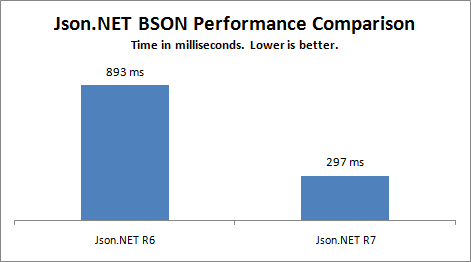

## Improved BSON Performance
  
[BSON](http://bsonspec.org/) performance has improved markedly in R7. Deserializing is as fast as it was before (i.e. ridiculously fast) but writing BSON has gotten a big boost when writing large complex objects. Using an extreme example this benchmark compares the previous release with the new BSON serializer:
  
 
  
## ShouldSerialize
  
Did you know that the good old [XmlSerializer](http://msdn.microsoft.com/en-us/library/system.xml.serialization.xmlserializer.aspx) had support for conditionally deciding what to serialize through [ShouldSerialize](http://msdn.microsoft.com/en-us/library/53b8022e%28VS.71%29.aspx) methods? Me neither.
  
Not to be outdone, Json.NET is now able to dynamically include and exclude properties the same way. Add a boolean method with the same name as a property and then prefixed the method name with ShouldSerialize. The result of the method determines whether the property is serialized.
  
In the example below possible circular references are manually handled by testing whether an employee is its own manager before serializing:
  
```csharp
public class Employee
{
  public string Name { get; set; }
  public Employee Manager { get; set; }

  public bool ShouldSerializeManager()
  {
    return (Manager != this);
  }
}
```

```csharp
Employee joe = new Employee();
joe.Name = "Joe Employee";
Employee mike = new Employee();
mike.Name = "Mike Manager";

joe.Manager = mike;
mike.Manager = mike;

string json = JsonConvert.SerializeObject(new []{ joe, mike }, Formatting.Indented);
// [
//   {
//     "Name": "Joe Employee",
//     "Manager": {
//       "Name": "Mike Manager"
//     }
//   },
//   {
//     "Name": "Mike Manager"
//   }
// ]
```

## Build Scripts

[](http://code.google.com/p/psake/)Now include with the Json.NET source code are the build scripts used to compile and package Json.NET. A couple of months ago I switched from a clunky old batch script I had been using to Powershell and [psake](http://code.google.com/p/psake/). Compared to past solutions I’ve written using NAnt I’m very happy with the results. XML be gone!

## And More

As always there are a crazy number of major (ISerializable support, LINQ to XML XmlConverter support) and minor new features (support for reading octal and hexadecimal numbers from JSON, numerous improvements to the serializer).

Json.NET Release 7 has the biggest change list yet - in fact I had to edit the descriptions of the changes down to fit them all in CodePlex’s [release notes](http://json.codeplex.com/releases/view/43775) size limit!

## Changes

Here is a complete list of what has changed since Json.NET 3.5 Release 6.

- New feature - Improved BSON performance
- New feature - Added WriteOid and WriteRegex to BsonWriter
- New feature - Added support for ShouldSerialize conditional methods
- New feature - Added TypeNameHandling to JsonProperty attribute. Allows a type names to be included on an individual property basis
- New feature - Support for reading octal and hexadecimal numbers from JSON
- New feature - Added support for enum values to LINQ to JSON
- New feature - Added TypeNameAssemblyFormat property to JsonSerializer
- New feature - Added DateTimeConverterBase
- New feature - Added JsonPrimitiveContract and JsonLinqContract
- New feature - Added CreateMemberValueProvider method to DefaultContractResolver
- New feature - INotifyCollectionChanged implemented on JContainer in Silverlight
- New feature - Included BSON in .NET 2.0, Silverlight and Compact Framework builds
- New feature - Added ReadRootValueAsArray, DateTimeKindHandling properties to BsonReader
- New feature - ISerializable support
- New feature - Added GetSchema, CanRead, CanWrite to JsonConverter
- New feature - LINQ to XML support added to XmlNodeConverter
- New feature - SerializeXNode, DeserializeXNode methods added to JsonConvert
- New feature - Added support for sharing a static cache for contract resolvers inheriting from DefaultControlResolver
- New feature - Added support for switching between dynamic and late bound reflection for medium trust environments
- New feature - Support for using implicit/explicit casts when converting a JSON property name to a dictionary value
- Change - JsonConverter.ReadJson method is now passed the existing value of the property it is converting
- Change - Built in JsonConverters are resolved once when the contract is created rather than runtime
- Change - JsonRaw removed and replaced with JRaw
- Change - Type is now always written as AssemblyQualifiedName
- Change - Dictionary key serialization falls back to ToString for keys
- Change - Schema generator now uses JsonContracts to determine schema information
- Change - Removed the "-" prefix when serializing a JSON constructor - prefix not compatible with XML naming standard
- Change - When converting JSON to XML using XmlNodeConverter, changed special JSON properties ($id, $ref, $type) to be attributes rather than child elements
- Fix - Fix dynamic code generation IL verification issues in .NET 4
- Fix - Fix error when deserializing nullable array
- Fix - Escape JSON property text
- Fix - Silverlight serialization security error
- Fix - Private base members marked with JsonProperty attribute now correctly serialized
- Fix - Error message when attempting to deserialize custom dictionary with no default constructor
- Fix - Correctly deserialize empty BSON objects
- Fix - When a class has a metadata class defined, fall back the original class from the metadata class when attribute not found
- Fix - Deserialize HashSet&lt;T&gt; without error
- Fix - Correctly skip ignored JSON properties when deserializing via a non-default constructor
- Fix - Schema with no properties now correctly validates
- Fix - Dictionary and array schemas now marked as nullable
- Fix - Serialize generic dictionary that doesn't implement IDictionary correctly
- Fix - CustomCreationConverter no longer errors when writing JSON
- Fix - JsonProperty.Readable and Writable not being correctly set for .NET properties with modified getter/setter visibility
- Fix - Fix error caused by private properties on a base class when reflecting a type
- Fix - Correct property CanRead and CanWrite coming back as false when a base class property has a private getter/setter visibility
- Fix - Fix reading BSON multi byte UTF8 characters
- Fix - CustomCreationConverter to return null when converting a null JSON value
- Fix - Fix for possible errors caused by mutable GetHashCode implementations and reference tracking
- Fix - Fix JTokenReader.ReadAsBytes to read strings as base64 data

## Links

[**Json.NET CodePlex Project**](http://json.codeplex.com/) 

**[Json.NET 3.5 Release 7 Download](http://json.codeplex.com/releases/view/43775)**  **** - Json.NET source code, documentation and binaries