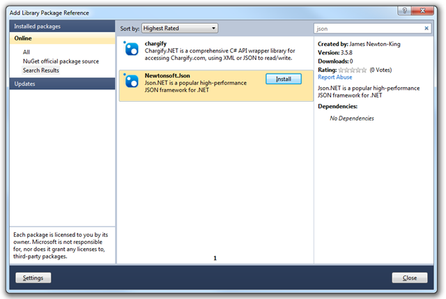

By popular demand: Json.NET 4.0! This is the first Json.NET release to target .NET 4 and integrates the many new features added in the latest version of .NET. Behind the scenes Json.NET’s source code has been upgraded to VS2010.
  
Other major changes in this release are two new builds and the removal of an existing build. Removed is Compact Framework. VS2010 no longer supports Compact Framework so 3.5 r8 will be its last release if you are targeting the Compact Framework. New on the other hand are builds for .NET 3.5 (the main build has been upgraded to .NET 4) and Windows Phone.
  
## Windows Phone dll
  
Json.NET 4.0 comes with a Windows Phone specific dll, compiled using the Windows Phone tools. The Silverlight build now targets Silverlight 4 so is no longer compatible with Windows Phone. A couple of little bonuses of Windows Phone having its own dll is that it doesn’t prompt with a warning when added. There is also some additional XML support. Because LINQ to XML is included in Windows Phone by default (it is an add-on dll for Silverlight) the Json.NET Windows Phone build has some XML features that are missing out of Silverlight release.
  
## Dynamic
  
One of the more interesting features introduced in .NET 4 is the dynamic keyword. Succinctly it allows variables and members to be statically typed as dynamic. The .NET type system that you know and love remains but operations involving dynamic values are evaluated at runtime.
  
Json.NET 4.0 adds support for dynamic in a couple of areas. The first and less visible of the two is in the JsonSerializer. Because there is no static list of fields or properties for a dynamic type the serializer interrogates the value for its members prior to serializing and deserializing. The end result is serializing should Just Work for any type that implements IDynamicMetaObjectProvider.
  
```csharp
dynamic value = new DynamicDictionary();

value.Name = "Arine Admin";
value.Enabled = true;
value.Roles = new[] {"Admin", "User"};

string json = JsonConvert.SerializeObject(value, Formatting.Indented);
// {
//   "Name": "Arine Admin",
//   "Enabled": true,
//   "Roles": [
//     "Admin",
//     "User"
//   ]
// }

dynamic newValue = JsonConvert.DeserializeObject<DynamicDictionary>(json);

string role = newValue.Roles[0];
// Admin
```

The second area with new dynamic support is LINQ to JSON. JObject properties can be accessed like that were members on a type and JValues can be converted to .NET types without casting, saving you the consumer precious KLOCs.

```csharp
JObject oldAndBusted = new JObject();
oldAndBusted["Name"] = "Arnie Admin";
oldAndBusted["Enabled"] = true;
oldAndBusted["Roles"] = new JArray(new[] { "Admin", "User" });

string oldRole = (string) oldAndBusted["Roles"][0];
// Admin

dynamic newHotness = new JObject();
newHotness.Name = "Arnie Admin";
newHotness.Enabled = true;
newHotness.Roles = new JArray(new[] { "Admin", "User" });

string newRole = newHotness.Roles[0];
// Admin
```

NuGet

Json.NET has a [NuGet](http://nuget.codeplex.com/) package available from the official NuGet package source. Right now it has Json.NET 3.5 Release 8 but expect it to be updated to Json.NET 4.0 in a couple of days.



## JSON Schema

Json.NET’s [JSON Schema](http://json-schema.org/) implementation has been updated to match version 3 of the specification. Notable new additions are patternProperties, exclusiveMinimum and exclusiveMaximum. Also new is the removal of optional which has been replaced with required. If you are using JSON Schema then you should check whether this change effects your schemas.

## BSON Binary

The [BSON spec](http://bsonspec.org/) has changed how binary values inside BSON should be written, deprecating the way Json.NET use to write binary values. Json.NET has been changed to use the new method.

Also worth noting is Json.NET had a bug with how it use to read and write the old binary values - this is fixed in Json.NET 4.0 but existing incorrect binary values will remain. Setting JsonNet35BinaryCompatibility on BsonReader will fix reading any existing BSON after upgrading to 4.0 but because of this bug and the change in how the spec says BSON binary values should be written it is recommended to update existing BSON to keep things consistent. This can be done by setting compatibility flag to true, reading BSON and then writing it back out again.

These changes only effect BSON that has binary values (i.e. byte arrays) written inside BSON.

## Changes

Here is a complete list of what has changed since Json.NET 3.5 Release 8.

- New feature - Added Windows Phone 7 project
- New feature - Added dynamic support to LINQ to JSON
- New feature - Added dynamic support to serializer
- New feature - Added INotifyCollectionChanged to JContainer in .NET 4 build
- New feature - Added ReadAsDateTimeOffset to JsonReader
- New feature - Added ReadAsDecimal to JsonReader
- New feature - Added covariance to IJEnumerable type parameter
- New feature - Added XmlSerializer style Specified property support
- New feature - Added support for deserializing to JToken
- New feature - Added CamelCaseText flag to StringEnumConverter
- New feature - Added WriteArrayAttribute to XmlNodeConverter to include an attribute to help round tripping JSON and XML
- New feature - Added OmitRootObject to XmlNodeConverter to skip writing the root JSON object when converting XML
- New feature - Added DeepClone and ICloneable implementation to JToken
- New feature - Added JSON schema PatternProperties, ExclusiveMinimum and ExclusiveMaximum for JSON schema spec 3
- New feature - Added .NET 3.5 project
- Change - Updated source code to VS2010
- Change - Updated main project to .NET 4
- Change - Updated Silverlight project to Silverlight 4
- Change - ICustomTypeDescriptor implementation moved to JObject
- Change - Improved error message when converting JSON with an empty property to XML
- Change - JSON schema Required replaced with Optional, as defined in JSON schema spec 3
- Change - JSON schema MaxDecimals replaced with DivisibleBy, as defined in JSON schema spec 3
- Remove - Compact Framework project removed. Compact Framework is not supported in VS2010
- Remove - JTypeDescriptionProvider and JTypeDesciptor removed
- Fix - BSON writing of binary values fixed. Added JsonNet35BinaryCompatibility flag for reading existing incorrect BSON binary values
- Fix - Timezone information no longer lost when deserializing DateTimeOffsets
- Fix - Decimal precision no longer lost when deserializing decimals
- Fix - SelectToken no longer skips the last project name when it is a single character
- Fix - Deserializing structs correctly set when reusing existing values is true
- Fix - Private getter/setters on base classes are now correctly accessible
- Fix - Nullable structs correctly deserialize
- Fix - JSON Schema option label now written correctly
- Fix - Deserializing a DataSet when it is a property of another object no longer breaks
- Fix - JToken Load and Parse methods now check that content is complete

## Links

**[Json.NET CodePlex Project](http://json.codeplex.com/)**

**[Json.NET 4.0 Release 1 Download](http://json.codeplex.com/releases/view/58535)** - Json.NET source code, documentation and binaries

[](http://www.dotnetkicks.com/kick/?url=http%3a%2f%2fjames.newtonking.com%2farchive%2f2011%2f01%2f03%2fjson-net-4-0-release-1-net-4-and-windows-phone-support.aspx)