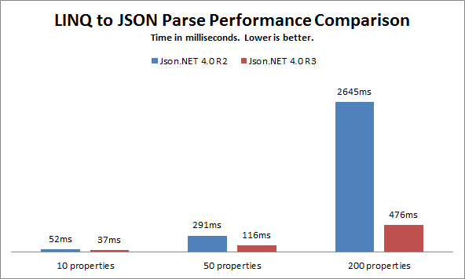
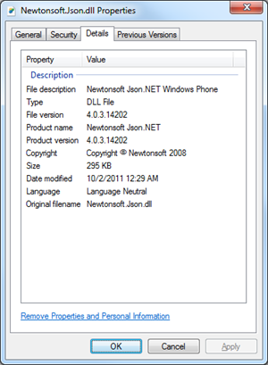

One of Json.NET's most popular features - LINQ to JSON - has gotten a speed boost.
  
Previously the LINQ to JSON collection objects (JObject and JArray) internally used a linked list to keep track of their children. While this gave them complete control over the order of properties inside objects, it made lookups by key (a property name for an object, an index for an array) slow over large JSON documents.
  
Json.NET 4.0 Release 3 changes the internal structure of the collection objects to eliminate linked lists - JArray now uses a list internally to store child values and JObject uses a combination of a list and dictionary, letting it preserve property order and make property name lookups O(1).
  

From your perspective the API for LINQ to JSON is exactly the same, it is just faster.
  
## Assembly file names
  
One thing to note in this release is that to play nicely with [NuGet](http://nuget.org/List/Packages/Newtonsoft.Json) the different versions of Json.NET now all use the same assembly file name: Newtonsoft.Json.dll
  
If you want to find out exactly which version of the dll you are using the Windows file properties dialog display's a .NET assembly's title as the File description.
  

  
## Changes
  
Here is a complete list of what has changed since Json.NET 4.0 Release 2.
  
- New feature - Improved support for deserializing objects using non-default constructors
- New feature - JsonConverterAttribute now allowed on constructor parameters
- New feature - JsonPropertyAttribute now allowed on constructor parameters
- New feature - Added Serializable attribute to exceptions
- New feature - JsonObject and JsonProperty attributes can now be placed on an interface and used when serializing implementing objects
- New feature - Improve TypeNameHandling.Auto to skip adding an unneeded type name for collection interfaces
- New feature - LINQ to JSON internals rewritten to use lists and dictionaries rather than linked lists
- New feature - Added support for deserializing to readonly collections and dictionaries on classes with non-default constructors
- New feature - Added serialization constructors to all Exceptions
- New feature - Added support for serialization event attributes on base classes
- New feature - Added support for BindToName on SerializationBinder
- New feature - Missing JSON errors can now be handled using JsonSerializer error handling
- New feature - Added Populate and IgnoreAndPopulate options to DefaultValueHandling for automatically populating default values during deserialization
- New feature - Added support for setting readonly fields when marked up with JsonPropertyAttribute
- New feature - Added Order to JsonPropertyAttribute to override the order of serialized JSON
- New feature - Added Culture to JsonTextReader to use when converting values from JSON text
- New feature - Added support for reading byte arrays from JSON integer arrays
- New feature - Added support for deserializing IDictionary properties
- New feature - Added ToObject to JToken for deserializing LINQ to JSON objects to a .NET object
- New feature - Added support for Guid, TimeSpan and Uri to LINQ to JSON
- Change - Changed WriteEndObject, WriteEndArray, WriteEndConstructor on JsonWriter to be virtual
- Change - Moved JPropertyDescriptor to Newtonsoft.Json.Linq namespace
- Change - Additional content after the $ref property now ignored when reading schema references
- Change - Changed JToken.Children to return an empty iterator rather than erroring
- Change - Changed the assembly file names to all be Newtonsoft.Json.dll to fix NuGet referencing
- Change - Changed $id and $ref properties to allow null
- Fix - Changed .NET 2.0 version to use LinqBridge source code rather than ilmerge to fix error
- Fix - Fixed deserializing to IEnumerable&lt;T&gt; properties
- Fix - Fixed DataTable and DataColumn names not being modified by CamelCasePropertyNamesContractResolver
- Fix - Fixed JObject loading JSON with comments
- Fix - Fixed error when using a Specified property with no setter
- Fix - Fixed transient constructor error on Windows Phone 7
- Fix - Fixed deserializing null values into nullable generic dictionaries
- Fix - Fixed potential casting error when writing JSON using a JsonReader
- Fix - Fixed converting emtpy XML elements with an array attribute not writing other attributes
- Fix - Fixed deserializing null values into DataTables
- Fix - Fixed error when deserializing readonly IEnumerable&lt;T&gt; array properties
- Fix - Fixed not including type name for byte[] values
- Fix - Fixed BsonWriter failing silently when writing values outside of an Object or Array
- Fix - Fixed serializer attempting to use dynamic code generation in partial trust
- Fix - Fixed serializing objects with DataContract and DataMember attributes on base classes

## Links
  
[**Json.NET CodePlex Project**](http://json.codeplex.com/)
  
[**Json.NET 4.0 Release 3 Download**](http://json.codeplex.com/releases/view/74287) - Json.NET source code, documentation and binaries