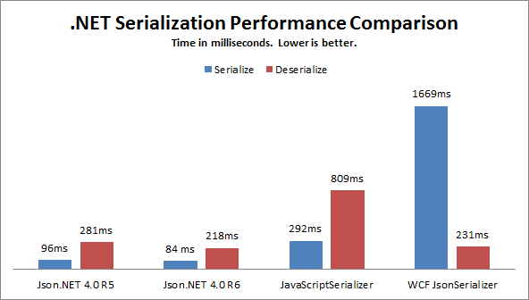

The big feature of this release is improved performance. For the first time in a couple of years I’ve sat down and benchmarked, profiled and tuned Json.NET.
  


For all its features Json.NET was already fast but there are improvements in JsonTextReader which I rewrote and object deserilization. Json.NET is faster than both .NET framework JSON serializers in all scenarios again.
  
## Improved error messages
  
One of the nice features of JsonTextReader is that it keeps track of its current line number and line position and includes that information when it encounters bad JSON.
  
This release adds that line number and position information to deserialization errors. Now deserialization should be much easier to troubleshoot.
  
```csharp
string json = @"[
  1,
  2,
  3,
  null
]";

List<int> numbers = JsonConvert.DeserializeObject<List<int>>(json);
// Error converting value {null} to type 'System.Int32'. Line 5, position 7.
```

## Worst. Bug. Ever. Fixed.

Visual Studio Ultimate Edition has a feature called [Intellitrace](http://msdn.microsoft.com/en-us/library/dd264915.aspx). Intellitrace and Json.NET [didn’t get along](https://www.google.com/search?q=json.net+intellitrace+operation+could+destabilize+the+runtime). After a year of at first being unsure why only some people were getting the error, and then not knowing what exactly why Intellitrace was breaking Json.NET, I finally nailed it down to one three line method that Intellitrace didn’t like. [Fixed... finally](http://json.codeplex.com/SourceControl/changeset/changes/64489).

## Changes

Here is a complete list of what has changed since Json.NET 4.0 Release 4 (if you’re curious where v5 is, it was just one fix for Windows Phone Mango and NuGet).

- New feature - Added line number information to deserialization errors
- New feature - Added ReadAsInt32 to JsonReader
- New feature - Added BinaryReader/BinaryWriter constructor overloads to BsonReader/BsonWriter
- Change - JsonTextReader error message when additional JSON content found is more descriptive
- Fix - Removed unused utility methods
- Fix - Fixed elusive Intellitrace runtime destabilization error
- Fix - Fixed internal exception thrown when deserializing Decimal/DateTimeOffset/Byte lists
- Fix - Fixed potential multi-threading serializing issue
- Fix - Fixed serializing types that hides a base classes property with a proeprty of the same name
- Fix - Fixed BsonReader to use BinaryReader instead of base stream
- Fix - Fixed referencing the NuGet package from Windows Phone 7.1 projects

## Links

**[Json.NET CodePlex Project](http://json.codeplex.com/)**

**[Json.NET 4.0 Release 6 Download](http://json.codeplex.com/releases/view/80975)** - Json.NET source code, documentation and binaries