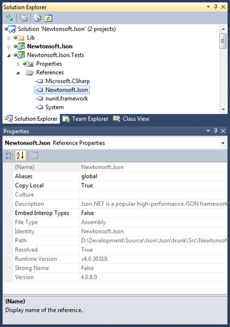

This is a relatively minor release that fixes all outstanding bugs and adds a couple of enhancements.
  
## NuGet Silverlight/Windows Phone Assemblies No Longer Strong-Named
  
The big change this release is that the Silverlight/Windows Phone NuGet assemblies are no longer strong-named.
  
Unfortunately Silverlight/Windows Phone applications [do not](http://wpdev.uservoice.com/forums/110705-app-platform/suggestions/2511980-assembly-binding-redirection-support) support redirecting strong-named assemblies like normal .NET apps do via [&lt;assemblyBinding&gt;](http://msdn.microsoft.com/en-us/library/twy1dw1e.aspx) configuration. If a Silverlight or Windows Phone application uses two libraries that each reference a different version of Json.NET then the only solution is to get the source code for the libraries and recompile them yourself to use the same version of Json.NET - not ideal.
  
From 4.0.8 the NuGet assemblies for Silverlight/Windows Phone are no longer strong-named. If you do need strong-named versions of Json.NET for SL/WP then they are still available in the [Json.NET zip download](http://json.codeplex.com/releases) from CodePlex in the **Bin\Silverlight\Signed** and **Bin\WindowsPhone\Signed** zip folders. I don’t recommend using them with reusable SL/WP libraries because of the reasons above. 
  
## Json.NET Assembly Redirection
  
In case you ever do end up with multiple libraries that reference different versions of Json.NET in a normal .NET application, here is the configuration to fix your application use one version of Json.NET:
  
```csharp
<runtime>
  <assemblyBindingxmlns="urn:schemas-microsoft-com:asm.v1">
    <dependentAssembly>
      <assemblyIdentityname="Newtonsoft.Json"publicKeyToken="30ad4fe6b2a6aeed" />
      <bindingRedirectoldVersion="1.0.0.0-4.0.0.0"newVersion="4.0.8.0" />
    </dependentAssembly>
  </assemblyBinding>
</runtime>
```

Update **newVersion** as needed to the version of Json.NET you are using. This can be found in Visual Studio by right-clicking on Newtonsoft.Json reference and selecting Properties.



## Changes

Here is a complete list of what has changed since Json.NET 4.0 Release 6 (if you’re curious where v7 is, it was a minor release to fix a couple of urgent bugs).

- New feature - Added VersionConverter for System.Version
- New feature - Added a JSON schema IsValid overload that returns a list of error messages
- Change - NuGet Silverlight/Windows Phone assembies are no longer strong-named
- Fix - Fixed Json.NET attributes on nullable struct properties not being used
- Fix - Fixed deserializing nullable enums
- Fix - Fixed JsonConstructor incorrectly being allowed on properties
- Fix - Fixed empty string being changed to null when deserializing object properties
- Fix - Fixed not replacing ignored properties when resolving an object's contract
- Fix - Fixed JsonReader.ReadAsDateTimeOffset throwing an incorrect error message
- Fix - Fixed error when converting XML to JSON with a default namespace
- Fix - Fixed JsonValidatingReader.ReadAsBytes throwing an exception
- Fix - Fixed a unit test failing because of the running computer’s timezone

## Links

**[Json.NET CodePlex Project](http://json.codeplex.com/)**

**[Json.NET 4.0 Release 8 Download](http://json.codeplex.com/releases/view/82120)** - Json.NET source code, documentation and binaries