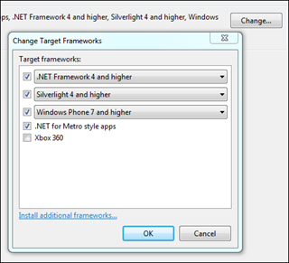

## Portable Class Library Build
  
Json.NET now has a [Portable Class Library](http://msdn.microsoft.com/en-us/library/gg597391.aspx) build that can be found in the /Bin/Portable directory from the zip download on [CodePlex](http://json.codeplex.com/). The portable build targets the absolute basics (.NET 4.0, SL4, WP7, Metro) and so hopefully should run on just about everything.
  
## Improved Collection Serialization
  
JsonArrayAttribute and JsonDictionaryAttribute now have properties to customize the serialization of collection items. ItemConverter, ItemTypeNameHandling, ItemReferenceLoopHandling and ItemIsReference will apply to all the items of that list/dictionary when serializing and deserializing.
  
## Changes
  
- New feature - Added Portable Class Library build
- New feature - Added support for customizing the JsonConverter, type name handling and reference handling of collection items
- New feature - Added Path to JsonReaderException/JsonSerializationException messages
- New feature - Added DateParseHandling to JsonReader
- New feature - Added JsonContainerContract
- New feature - Added JsonDictionaryAttribute
- Change - Instances of Exception have been changed to be a more specific exception
- Fix - Fixed Windows Application Certification tool error by removing AllowPartiallyTrustedCallersAttribute
- Fix - Fixed JsonWriters not using DateTimeZoneHandling

## Links
  
[**Json.NET CodePlex Project**](http://json.codeplex.com/)
  
[**Json.NET 4.5 Release 4 Download**](http://json.codeplex.com/releases/view/86584) - Json.NET source code, documentation and binaries