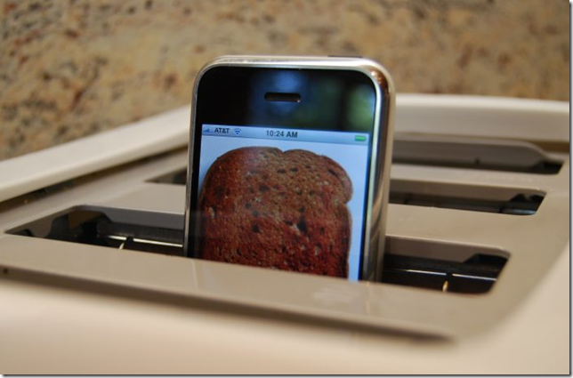

Word on the [twitter](http://twitter.com/redth/statuses/3697053804) is that [Json.NET](http://www.newtonsoft.com/json) runs on the iPhone via [Monotouch](http://www.mono-project.com/MonoTouch). Very cool.
  
