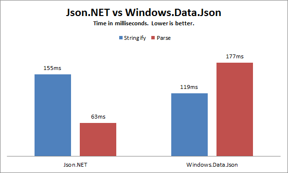

Windows 8 introduces a new way to work with JSON via the [Windows.Data.Json](http://msdn.microsoft.com/en-us/library/windows/apps/xaml/br240639.aspx) namespace. Similar to LINQ to JSON in [Json.NET](http://www.newtonsoft.com/json) it defines classes that can be used to parse values, strings, objects, and arrays from JSON text or serialize value types into JSON text.
  
Below is a comparison of Json.NET’s LINQ to JSON to Window 8’s Windows.Data.Json.
  
## Creating JSON
  
The big difference between the two libraries when creating JSON is Windows.Data.Json requires string/integer/double values to be explicitly converted to JsonValue objects.
  
Note that there is a weird limitation to creating JSON with Windows.Data.Json: it doesn’t allow you to set properties to null or have null array values.
  
```csharp
// Windows.Data.Json
// -----------------
JsonObject jsonObject = new JsonObject
  {
    {"CPU", JsonValue.CreateStringValue("Intel")},
    {"Drives", new JsonArray {
        JsonValue.CreateStringValue("DVD read/writer"),
        JsonValue.CreateStringValue("500 gigabyte hard drive")
      }
    }
  };
string json1 = jsonObject.Stringify();

// LINQ to JSON
// ------------
JObject jObject = new JObject
  {
    {"CPU", "Intel"},
    {"Drives", new JArray {
        "DVD read/writer",
        "500 gigabyte hard drive"
      }
    }
  };
string json2 = jObject.ToString();
```

## Querying JSON

Windows.Data.Json requires a value to be cast to its exact type with the GetObject/GetArray methods before it can be used, making Windows.Data.Json’s code verbose compared to LINQ to JSON.

```csharp
string json = @"{
  ""channel"": {
    ""title"": ""James Newton-King"",
    ""link"": ""http://james.newtonking.com"",
    ""description"": ""James Newton-King's blog."",
    ""item"": [
      {
        ""title"": ""Json.NET 1.3 + New license + Now on CodePlex"",
        ""description"": ""Annoucing the release of Json.NET 1.3, the MIT license and the source being available on CodePlex"",
        ""link"": ""http://james.newtonking.com/projects/json-net.aspx"",
        ""category"": [
          ""Json.NET"",
          ""CodePlex""
        ]
      }
    ]
  }
}";

// Windows.Data.Json
// -----------------
JsonObject jsonObject = JsonObject.Parse(json);
string itemTitle1 = jsonObject["channel"].GetObject()["item"].GetArray()[0].GetObject()["title"].GetString();

// LINQ to JSON
// ------------
JObject jObject = JObject.Parse(json);
string itemTitle2 = (string)jObject["channel"]["item"][0]["title"];
```

## Performance

Json.NET is slightly slower at writing JSON than Windows.Data.Json but considerably faster parsing.



## Converting Between LINQ to JSON and Windows.Data.Json

Json.NET supports converting between the types of the two libraries. Use [FromObject](http://www.newtonsoft.com/json/help/index.html?topic=html/Overload_Newtonsoft_Json_Linq_JToken_FromObject.htm) to convert a Windows.Data.Json value to LINQ to JSON and use [ToObject](http://www.newtonsoft.com/json/help/index.html?topic=html/Overload_Newtonsoft_Json_Linq_JToken_FromObject.htm) to convert LINQ to JSON to Windows.Data.Json.

```csharp
JsonObject jsonObject = new JsonObject
  {
    {"CPU", JsonValue.CreateStringValue("Intel")},
    {"Drives", new JsonArray {
        JsonValue.CreateStringValue("DVD read/writer"),
        JsonValue.CreateStringValue("500 gigabyte hard drive")
      }
    }
  };

// convert Windows.Data.Json to LINQ to JSON
JObject o = JObject.FromObject(jsonObject);

// convert LINQ to JSON to Windows.Data.Json
JArray a = (JArray)o["Drives"];
JsonArray jsonArray = a.ToObject<JsonArray>();
```