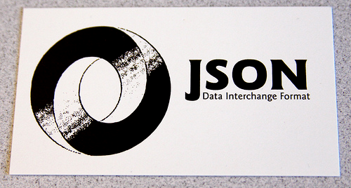
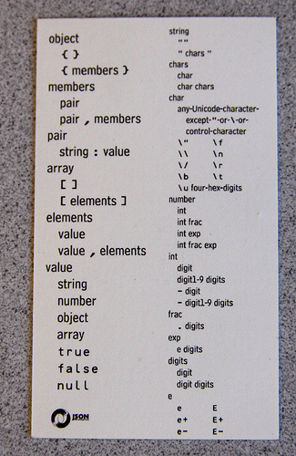

Front:
  

Back:
  

Awesome.
  
I think it is pretty cool that the entire standard can be put on the back of a business card (and a quarter of that is for defining what a number is!).
  
From [here](http://www.flickr.com/photos/equanimity/3762360637/).