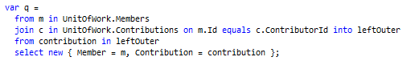
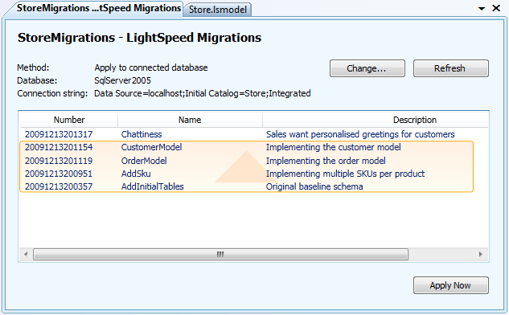

The guys at Mindscape have just released the third version of [LightSpeed](http://www.mindscape.co.nz/products/LightSpeed/default.aspx).
  
For anyone that doesn’t know LightSpeed is an ORM for .NET and is far and away my favourite. Over the last couple of years it has been exciting to see the progress LightSpeed has made as a product and it has matured to the point where I can’t of any additional features I could want from it.
  
## LINQ Support++
  
The two big additions in LightSpeed 3.0 for me are full LINQ support and database migrations. I’m a bit of a fiend when it comes to writing complex SQL so it is great that LightSpeed now has the LINQ support to keep up with the crazy queries I throw at it.
  
 
  
(note: a boring sample query from the Mindscape blog post... I write LINQ that is illegal in some countries...)
  
## Database Migrations
  
I haven’t had the chance to check out LightSpeed 3.0’s database migration features yet but I know pain of putting together SQL change scripts. I’m looking forward to using it.
  

  
## And More
  
The [change log](http://www.mindscape.co.nz/products/lightspeed/changelog.aspx) for LS3 is impressively large, I’ve barely scratched the surface. Congrats to the Mindscape guys for making the best .NET ORM even better.
  
Check LightSpeed 3.0 out [here](http://www.mindscape.co.nz/products/LightSpeed/default.aspx).