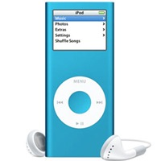

I'd like to thank the [Mindscape](http://www.mindscape.co.nz/) team for the iPod they gave me. Mindscape ran a [competition](http://www.mindscape.co.nz/blog/?p=26) for feedback given during LightSpeed's beta and my name came out of the hat.
 
I had a good time using it with my [Silverlight project](http://www.newtonsoft.com/blog/archive/2007/07/03/first-silverlight-project-trafficwarden.aspx) and it was great seeing them implement some of my suggestions. 
 
[LightSpeed iPod Winner](http://www.mindscape.co.nz/blog/?p=38)