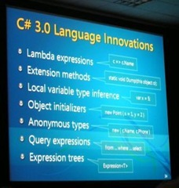

In a previous blog post I showed how to efficiently iterate over a [WordprocessingML](http://openxmldeveloper.org/archive/category/1003.aspx)'s document content when creating an object model.
 
One of the interesting quirks of WordprocessingML is that the content of sections (a section defines information like page size and orientation), instead of being nested inside a section element, are determined by a marker section element in the final paragraph of the section. On top of that, the final section of a document is handled completely differently with the section element instead appearing on the body at the very end of the document.
 
While I suspect there are good reasons for doing this (I'm guessing the aim was to minimize the amount of change to the document XML structure when doing updates. I'd love to find out if anyone knows), it does make parsing the document and splitting content into sections more difficult. Fortunately with the power of LINQ we can solve this problem in just a couple of statements.
 
## Example
 
```csharp
private List<Section> CreateSections(List<Content> content, SectionProperties finalSectionProperties)
{
  var sectionParagraphs =
    content.Select((c, i) => new { Paragraph = c as Paragraph, Index = i })
    // only want paragraphs with section properties
    .Where(o => o.Paragraph != null && o.Paragraph.Properties.SectionProperties != null)
    // get the section properties
    .Select(o => new { SectionProperties = o.Paragraph.Properties.SectionProperties, o.Index })
    // add the final section properties plus end index to result
    .Union(new[] { new { SectionProperties = finalSectionProperties, Index = content.Count - 1 } })
    .ToList();

  List<Section> sections = new List<Section>();
  int previousSectionEndIndex = -1;
  foreach (var sectionParagraph in sectionParagraphs)
  {
    List<Content> sectionContent =
      content.Select((c, i) => new { Content = c, Index = i })
      .Where(o => o.Index <= sectionParagraph.Index && o.Index > previousSectionEndIndex)
      .Select(o => o.Content)
      .ToList();

    Section section = new Section(this, sectionContent, sectionParagraph.SectionProperties);
    sections.Add(section);

    previousSectionEndIndex = sectionParagraph.Index;
  }

  return sections;
}
```

The first LINQ statement queries the document content and gets all paragraphs that have associated SectionProperties along with their position within the content. That information is then returned in an anonymous type. The position comes from the [Select method](http://www.hookedonlinq.com/SelectOperator.ashx), which has an overload that returns the items position as well as item itself. Since the final section properties object is outside the content and therefore not in a paragraph it is unioned on to the end of the result with the position as the end of the content collection.

Now that we have all of the sections and their end positions we loop over the query's result and create a Section object which is passed the Section properties and the document content that lies in between the section end index and the previous section end index, again using the Select overload that returns an element's position to find the wanted content.

And that is pretty much it. There is nothing here that couldn't be achieved in C# 2.0 but using LINQ, lambda expressions, anonymous types and type inference C# 3.0 has probably halved the amount of code that would otherwise be required and made what is there much more concise and understandable. I'm definitely looking forward to using LINQ more in the future.