I do a lot of [Azure](http://www.azure.com/) development. While it is a great platform for setting up new environments, scaling instances and simple deployments; monitoring applications in Azure is difficult. It is a remote environment and because of the way Azure abstracts hosting for you there is no option to install your own software on the server.

[Foglight for Azure Apps](http://foglight-on-demand.com/) is a hosted service that sets up gathering information from Windows Azure for you. In this blog post I'm going to try out Foglight with a demo application I've put together for simulating a broken website (demo source code available at the end of the blog post).

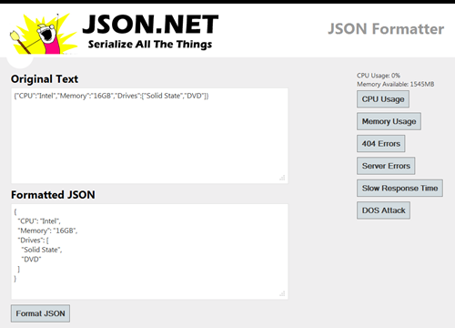

## Getting Started

Setting up Foglight for Azure Apps is really simple. Foglight has two configuration methods for adding an Azure deployment: manual configuration where you manually add details about each deployment you want to monitor, and automatic discovery where Foglight retrieves that information from Azure for you. I'm going to step through using the automatic discovery wizard.

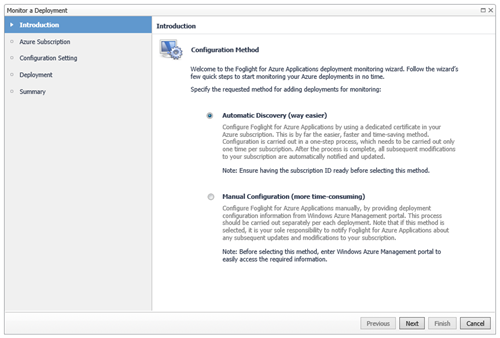

With Foglight automatic discovery the only information you need is your role's Azure Subscription ID. Subscription IDs can be found in the Windows Azure Management Portal by browsing to Settings -&gt; Management Certificates.

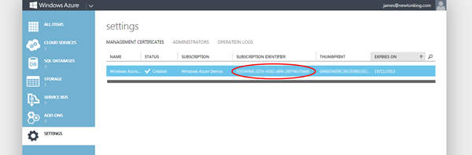

The next step after copy/pasting your Subscription ID is to add a management certificate from Foglight to Azure. The download link for the certificate is in the wizard and it is uploaded in the same place where you got your Subscription ID.

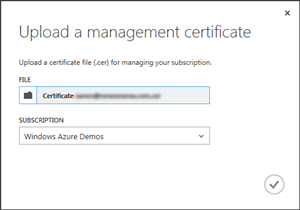

Finally select the deployment you want to monitor and you're finished.

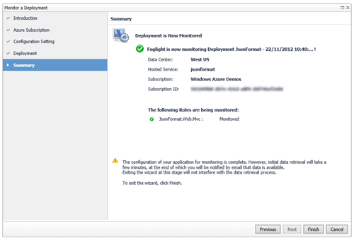

## Monitoring

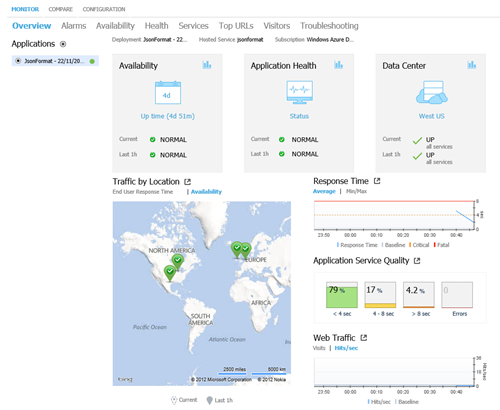

The core of Foglight for Azure Apps are the monitors it provides to measure the health of your application. The first page you'll come upon after setup is the dashboard which provides a nice summary of the state of your application. From this screen or from the menu you can drill into more detail about each monitor.

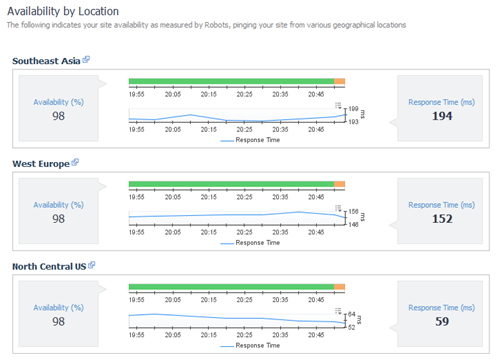

The availability page shows you whether your application is accessible from various locations around the world - useful for times when a user or users from a country report they can't access your application. In the screenshot above I've activated server errors on my demo website which you can see showing up in orange in the availability graphs.

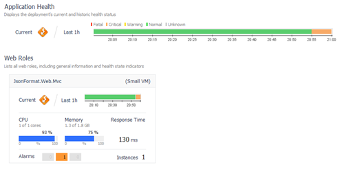

The health page lets you view health details about individual rolls in your application. Here you can see details like CPU, memory and disk usage, and HTTP traffic and bandwidth being used by each role. One nice feature here is Foglight aggregates everything together and provides an indication of whether the application is healthy or not. Seeing the health of an application in a graph over time lets you match user reported errors with past server problems. In the screenshot above I've active high CPU and memory usage in my demo application.

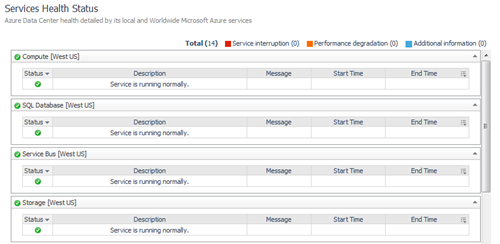

The services page shows the status of the Windows Azure services your application depends on (e.g. compute, databases, storage) in your application's region and the status of worldwide services (e.g. management portal, CDN). This is a useful tool when debugging a broken application to double check whether the issue is yours or is being caused by a problem in Azure infrastructure.

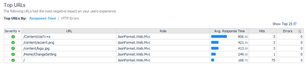

The top URLs page shows what URLs in an application are creating problems. URLs can either be the slowest pages in your application or the pages with the highest number of 404 and server errors.

## Configuring Health and Alerts

An awesome feature of Foglight is the control you have over configuring health thresholds and sending alerts.

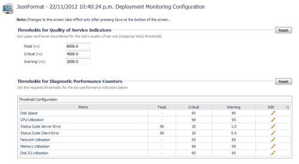

Once you're happy with the health thresholds (the screenshot above shows the default) you can then configure at what health level alerts should be emailed and who they should be emailed to.

Health alerts are one of the most important features when monitoring, letting you know about problems as soon as they happen rather than waiting until someone look at Foglight or hear about errors from your users.

One thing I've done in the past with errors is to send an SMS message to my phone. Foglight doesn't have built in SMS support but it is simple to set up using [IFTTT](https://ifttt.com/).

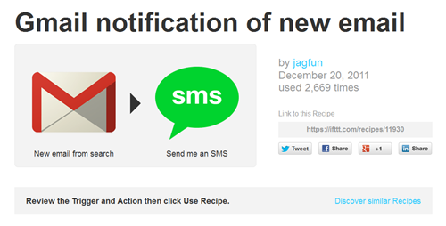

## Wrapping Up

I found Foglight's monitoring easy to understand and fast to update. Really impressive is how simple Foglight is to setup, taking just a couple of minutes and requiring no changes to your application. Finally the Foglight's health alerts will ensure you know about critical issues as they happen.

If you're deploying applications to Azure and it is important they are rock solid then I recommend you check [Foglight for Azure Apps](http://foglight-on-demand.com/) out.

**[Click here to download the Windows Azure JsonFormat application source code](../../public/monitoring-windows-azure-with-foglight/jsonformat.zip)**

*Disclosure of Material Connection: I received one or more of the products or services mentioned above for free in the hope that I would mention it on my blog. Regardless, I only recommend products or services I use personally and believe my readers will enjoy. I am disclosing this in accordance with the Federal Trade Commission's 16 CFR, Part 255:* [*Guides Concerning the Use of Endorsements and Testimonials in Advertising.*](http://www.access.gpo.gov/nara/cfr/waisidx_03/16cfr255_03.html)