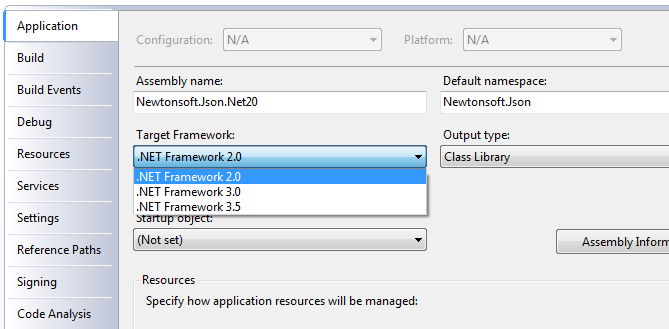
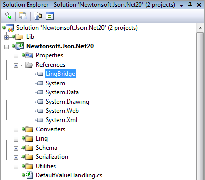
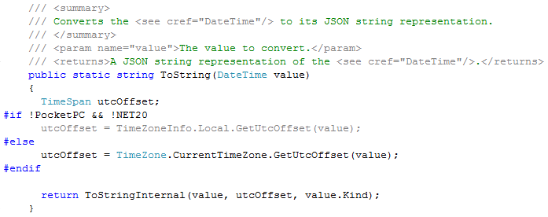

>    
> “There are those who said this day would never come. What are they to say now?” - [Prophet of Truth](http://halo.wikia.com/wiki/Prophet_of_Truth), Halo 2
>  

As of the latest source code commit, [Json.NET 3.5](http://www.newtonsoft.com/json) supports running on the .NET 2.0 framework. Yes you read that right all you dot-net-two-point-oh-ers, next release expect a hot, hot *Newtonsoft.Json.Net20.dll* coming your way.
  
## LINQ enabling a .NET 2.0 application
  
The main barrier to getting Json.NET running on .NET was LINQ - both usages internally inside Json.NET and unsurprisingly for LINQ to JSON. Fortunately getting LINQ running in a .NET 2.0 application is just a couple of steps.
  
1. Set the project target framework
  
The first thing you will need is VS2008 - it has the syntax support for extension methods and lambda expressions. VS2008 also has the ability to target a project against a specific version of the .NET framework. By setting the target framework to .NET 2.0 Visual Studio will remove all the assemblies from that project that have been added post 2.0 such as WCF, WPF, LINQ to SQL, LINQ to XML, etc.
  


2. Reference LINQBridge
  
Although VS2008 projects targeting .NET 2.0 still support extension methods and lambda expressions in code, without the LINQ assemblies added in 3.5 none of the LINQ extension methods (Select, Where, OrderBy) are available to use.
  
The solution is [LINQBridge](http://www.albahari.com/nutshell/linqbridge.aspx), an open source reimplementation of the LINQ classes and assembly methods. LINQBridge looks and acts exactly the same as LINQ in .NET 3.5, right down to the *System.Linq* namespace. Just add a reference to LINQBridge.dll to the project and you’re done. Enjoy LINQ in your .NET 2.0 application!
  


3. Preprocessor #if tests - Optional
  
This step is only necessary if you’re targeting multiple framework versions using multiple projects. The [preprocessor](http://msdn.microsoft.com/en-us/library/4y6tbswk.aspx) lets you enable and disable portions of code based on conditional compilation symbols defined in a project. The Newtonsoft.Json.Net20 project defines the NET20 symbol and is used to disable portions of code that deal with functionality not available in .NET 2.0.
  


4. Merge LINQBridge.dll into your application - Optional
  
If you don’t want to distribute LINQBridge.dll with your application then [ILMerge](http://research.microsoft.com/en-us/people/mbarnett/ilmerge.aspx) is a free command line app from Microsoft for merging .NET assemblies together. In my Json.NET build script I have used ILMerge to build LINQBridge.dll into Newtonsoft.Json.Net20.dll. The end user will never have to worry about the additional file.
  
```csharp
ilmerge.exe /internalize /out:Newtonsoft.Json.Net20.Merged.dll Newtonsoft.Json.Net20.dll LinqBridge.dll
```

And that’s it. The next version of Json.NET will include the new 2.0 assembly or [download the source code](http://json.codeplex.com/SourceControl/ListDownloadableCommits.aspx) for yourself now.