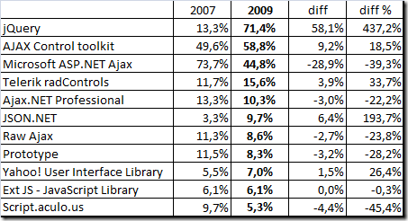

[Json.NET usage up 193%](http://codeclimber.net.nz/archive/2009/06/22/ajax-survey-2009-jquery-and-ms-ajax-are-almost-tied.aspx) \*
  
 
  
\* [Chris](http://www.syringe.net.nz/) immediately started to point out the statistical flaws of the survey. My response was that regardless, Json.NET's share of the flawed survey market has increased 😉