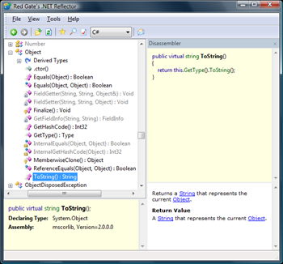

The low bandwidth version of MSDN has gotten a lot of [attention](http://weblogs.asp.net/jgalloway/archive/2008/08/30/msdn-low-bandwidth-bookmarklet.aspx) recently. Allow me to suggest an alternative for when you're trying to figure out how a class or method works, one which happily doesn’t use any bandwidth at all: [Reflector](http://www.red-gate.com/products/reflector/).

Reflector is a .NET assembly browser from Red Gate. It free and weighs in at a svelte 1MB.

What Reflector does is it disassembles any .NET dll on the fly and provides a nice interface to navigate, search, and analyze the assembly’s class hierarchy. Quickly searching over the types in a dll is useful but the really cool thing about Reflector is it goes a step further and decompiles the contents of properties and methods, displaying them in C#.

The reason why I prefer Reflector over MSDN is simple: What better way of discovering what a class or method does than by reading the code itself?

I don’t say that to be masochistic and make things hard or to lord superiority over anyone who does use MSDN but because I think that after writing code, the next best thing you can do to become a better developer is to read it.

- **Code comprehension.** Being comfortable with understanding other peoples code is a key skill for a developer to have (we spend far more time reading code than writing it). Digging through raw undocumented code in Reflector and figuring out what it does is certainly a great way to practice.
- **New ideas.** Whether you’re checking out how the LINQ [where statement](http://msdn.microsoft.com/en-us/library/system.linq.enumerable.where.aspx) works or you’re browsing what goes on inside the [.NET configuration classes](http://msdn.microsoft.com/en-us/library/system.configuration.configurationelement.aspx), you will see a lot of different problems being solved in different ways. The more you see something solved the better you’ll be able to tell a good approach from a bad one.
- **.NET isn’t magic.** Seeing a chart of the [ASP.NET page lifecycle](http://www.eggheadcafe.com/articles/o_aspNet_Page_LifeCycle.jpg) is one thing, but opening up the [Page](http://msdn.microsoft.com/en-us/library/system.web.ui.page.aspx) class in Reflector and seeing it happen in code in the ProcessRequestMain() is another 😊

There are cases when checking out MSDN is the right thing to do to figure out how something works but your first port of call should be Reflector.

[Download Reflector](http://www.red-gate.com/products/reflector/) and give it a try. You’ll be a better developer for it.