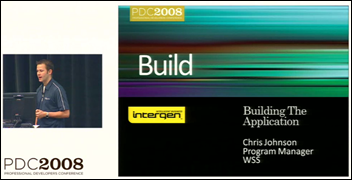
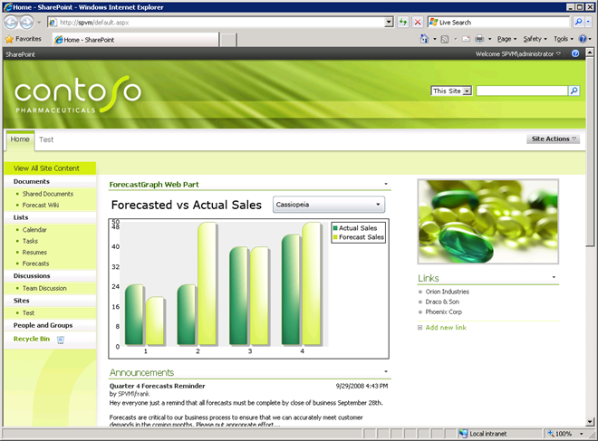

The rip in the fabric of space time between our universe and the [bizzaro universe](http://en.wikipedia.org/wiki/The_Bizarro_Jerry), where I am a SharePoint expert, continues to grow. First I presented a [400 level SharePoint session at TechEd](/archive/2008/09/03/teched-2008-summary) and now I have helped put together a SharePoint presentation for PDC!

“Creating SharePoint Applications with Visual Studio 2008” presented by Chris Johnson walks through creating a SharePoint application using the Visual Studio 2008 extensions for SharePoint (VSeWSS). A bunch of people from Intergen contributed to the end product. I helped write the overall script with Mark Orange, one of Intergen's actual SharePoint experts, and I wrote the application used in the presentation.
  
- [Channel 9 Video](http://channel9.msdn.com/pdc2008/BB13/)
- [Presentation Code](http://blogs.msdn.com/cjohnson/archive/2008/11/05/bb13-sharepoint-2007-creating-sharepoint-applications-with-visual-studio-sample-code.aspx)

The application featured a new project announced at PDC: the [Silverlight Control Toolkit](http://www.codeplex.com/Silverlight). SharePoint hosted a Silverlight chart control that visualized data called from a WCF web service and SharePoint's web services.
  
## PDC Fireworks
  
The Wellington .NET usergroup had a [special event](http://pageofwords.com/blog/2008/10/27/PDCFireworksInWellington.aspx) last week covering what was announced at PDC. I gave a brief 15 minute introduction to using the Silverlight chart control. You can get the slides from my talk (all 6 of them!) [here](../../public/pdc-2008-creating-sharepoint-applications-with-visual-studio-2008/silverlightcharting.pptx).
  
