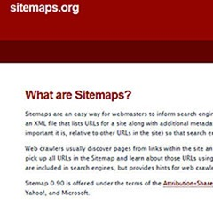

GoogleSitemap.NET has been renamed and re-released as Sitemaps.NET 1.1. When I originally wrote it in 2005, XML sitemaps were a Google only feature but since then Microsoft, Yahoo and Google have [gotten together](/archive/2007/02/28/Sitemaps.org) to create a standard, hence the rename.
 
There a couple of changes and bug fixes in 1.1 but nothing major.
 
- New feature - Ability to ignore URLs in your ASP.NET sitemap by adding the attribute sitemapsIgnore="true"
- Change - Renamed from GoogleSitemap.NET to Sitemaps.NET to reflect the new standard at http://www.sitemaps.org
- Change - Namespace updated to http://www.sitemaps.org/schemas/sitemap/0.9
- Bug fix - Fixed culture issues related to writing the decimal point in a URL's priority

While I was putting Visual Studio's rename refactor through its paces I also changed the license, created a Sitemaps.NET page on my blog [here](/projects/sitemaps-net.aspx) and created a CodePlex project containing the source. Links below.
 
[**Sitemaps.NET CodePlex Project**](http://www.codeplex.com/Sitemaps)
 
[**Sitemaps.NET 1.1 Download**](http://www.codeplex.com/Sitemaps/Release/ProjectReleases.aspx)