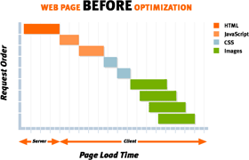
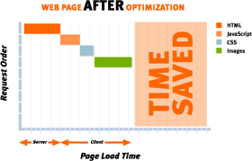

Earlier this year I worked on an exciting product called the [Runtime Page Optimizer](http://www.getrpo.com) (RPO). Originally written by the guys at [ActionThis](http://www.actionthis.com/) to solve their website's performance issues, I had the opportunity to develop it with them and help turn the RPO into a product that works on any ASP.NET website.
  
## How RPO works
  
At its heart the RPO is a [HttpModule](http://msdn.microsoft.com/en-us/library/system.web.ihttpmodule.aspx) that intercepts page content at runtime, inspects it, and then rewrites the page so that is optimized to be downloaded to the client. Because the RPO is a module it can quickly be added to any existing ASP.NET website, creating instant performance improvements.
  
## What RPO optimizes
  

The RPO does three things to speed up a web page:
  
- **Reduces HTTP requests**  Reducing the number of resources on a page often produces the most dramatic improvement in performance. A modest sized web page can still take a significant amount of time to load if it contains many stylesheets, scripts and image files.       The reason for this is most of the time spent waiting for a web page to load is not for large files to download but from [HTTP requests bouncing between the browser and the server](http://yuiblog.com/blog/2006/11/28/performance-research-part-1/). The RPO fixes this by intelligently combining CSS and JavaScript text files together and merging images through [CSS spriting](http://websiteoptimization.com/speed/tweak/css-sprites/). Fewer resources means less time wasted from HTTP requests and faster page loads.

- **Compresses Content**       RPO minifies (whitespace removal) and zip compresses JavaScript and CSS files, as well as the ASP.NET page itself. Compression reduces page size, saves bandwidth and further decreasing page load times.

- **Caching**       The RPO ensures all static content has the correct HTTP headers to be cached on a user's browser. This further decreases "warm" page load times and saves even more bandwidth. When resources change on the server, the client-side cache is automatically refreshed.

## Other stuff

- Every site is different so the RPO has [extensive configuration options](http://www.getrpo.com/Product/HowItWorks/) to customize it to best optimize your ASP.NET application. RPO has been used on ASP.NET AJAX, MVC, SharePoint, CRM, EpiServer and DotNetNuke websites.
- Lots of thought has been put into performance. The RPO caches all combined content and supports load balancing. Once combined content has been cached the only thing that happens at runtime is lightweight parsing of HTML, which is darn quick. I know because I wrote it that way 😊
- The RPO supports all browsers, including new kid on the block: Chrome. RPO is even smart enough to [take advantage of features only available in certain browsers](http://www.websiteoptimization.com/speed/tweak/inline-images/) and supply specially customized content to further improve page load times.
- The industrious people at RPO are making a version for Apache.

Working on the RPO was a great experience. Some very smart people are behind it and everyone contributed something unique to make RPO the awesome tool that it is today.
  
RPO is out now and a fully featured trial is available at [getrpo.com](http://www.getrpo.com/). Check it out!
  

## Update:

I noticed there is a [question about the RPO on StackOverflow](http://stackoverflow.com/questions/81108/runtime-page-optimizer-for-aspnet-any-comments) (I've been using StackOverflow a lot lately, excellent resource). The question discussion has some positive comments from users who have tried the RPO out.