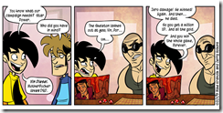

 
  
**The Penny Arcade Podcast** - [For The Vin](http://www.penny-arcade.com/2009/4/20/)
  
The authors of the comic website [Penny Arcade](http://www.penny-arcade.com/) record their thought process as they write a comic strip.
  
In this episode they discuss their experiences of being molested at Disneyland by [costumed characters](http://disney-desktop-wallpaper.com/walt-disney-world/chip-and-dale.jpg), Swedes doing time in the big house for IP infringement, fantasy books and recruiting [Vin Diesel into their DnD party](http://www.penny-arcade.com/comic/2009/4/20/).
  

  
**This American Life** - [The Fix Is In](http://www.thislife.org/Radio_Episode.aspx?sched=1317)
  
Corporate crime is fascinating. Your average burglar isn't the sharpest tool in the shed and neither is the crime he commits so it is interesting to see what happens when smart people decide that the law doesn't apply to them. Examples: [Enron scandal](http://en.wikipedia.org/wiki/Enron_scandal), [Madoff's $65 billion Ponzi scheme](http://en.wikipedia.org/wiki/Madoff_investment_scandal).
  
[The Fix Is In](http://www.thislife.org/Radio_Episode.aspx?sched=1317) is a rerun show from 2000 about a global price fixing conspiracy and the executive, Mark Whitacre, who cooperated with the FBI in exposing it. Whitacre goes to amazing lengths to gather evidence and was described by the FBI as the most cooperative witness in their history. A film has even been made about his exploits: [The Informant!](http://en.wikipedia.org/wiki/The_Informant!) - appropriately a comedy.

Awesome.