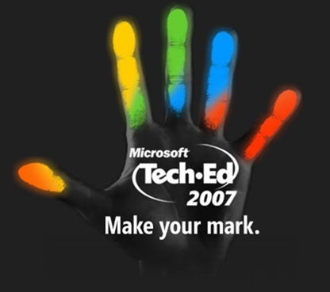

[TechEd](http://www.microsoft.com/nz/teched07/index.aspx) is starting in a couple of days and I'm heading up with some fellow [Intergenites](http://www.intergen.co.nz/) to run the hands on labs. I tutored and ran lab workshops while at University so it should be a fun blast from the past. Look out for us in the yellow camo pants.

As well as the HOL crew, a number of people from Intergen are going to be giving presentations this year: Andrew Tokeley will be talking about the new dynamic data controls in ASP.NET, Mark Orange will be talking about SharePoint document management and content management, and [Chris Auld](http://www.syringe.net.nz/) will be talking about developing applications with office and this [ActionThis](http://www.actionthis.com/) thing.

See you there!