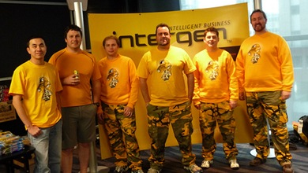
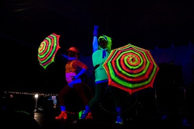

[TechEd NZ 2008](http://www.microsoft.com/nz/teched08/index.aspx) is over! These are my thoughts and experiences of this year's TechEd.

## Day 1

## Keynote

You uh, don't need to applaud that.")The keynote started off with a surprise: Speakers from National and Labour were invited to present their broadband/IT policies. [John Key](http://en.wikipedia.org/wiki/John_Key) presented for National and was evangelising there policy of fibre to the home across the nation. I was impressed by how down to earth his speaking styling was and he got great lulz with his pitch "A vote for National is a vote for high definition porn". [David Cunliffe](http://en.wikipedia.org/wiki/David_Cunliffe) presented Labour's policy. He also spoke really well although after Key's laid back speech it felt much more political to me. Labour isn't investing as much in broadband as National and a lot of his time was spent spreading fear and uncertainty about how National will spend the money it has pledged.

Once the politicians had finished pontificating (which was too long), [Amit Mital](http://www.microsoft.com/nz/teched08/keynote.aspx), general manager of the Live Mesh platform got up to talk. His content was more practical compared to last years keynote by Lou Carbone but I didn't enjoy it nearly as much. Weirdly after talking about [Live Mesh](https://www.mesh.com/Welcome/Welcome.aspx) and hyping it up we never saw a demo of it in action.

## Hands On Labs

I contributed to the [Hands On Labs](http://www.microsoft.com/nz/teched08/hands-on-labs.aspx) launcher this year and I went and had a look at the lab room early on day 1. I didn't mention work on it before TechEd started incase everything went horribly wrong but from everything I have heard the labs were a great success. It is now safe to associate myself with it 😉

The most interesting and visible change I made is lab manuals no longer need to be printed out but instead are displayed on a second screen. The usability is better than the tradition paper manuals (copy and paste from the manuals ftw!) and it doesn't require a couple of trees worth of paper to print everything out 100 times.

After looking at a couple of alternatives I chose to convert the manual documents to the [XPS format](http://en.wikipedia.org/wiki/XML_Paper_Specification) and displaying them using the WPF [DocumentViewer](http://msdn.microsoft.com/en-us/library/system.windows.controls.documentviewer.aspx). This approach ended up being really simple and provides a great user experience. Since it is WPF I was able to style up the DocumentViewer with [Intergen](http://www.intergen.co.nz/) colours and logos. When I told Scott Hanselman about what I had done with the hands on lab launcher this year he was somewhat shocked and said it was the first time he had heard of anyone actually using XPS's.

## Ask The Experts

Finally a chance to legitimately wear a hat with the word "Expert" on it! Since my session was on the Office stream I was an Office expert which I thought was pretty funny.

## Day 2

## OFC404 - Open XML Development Turning SharePoint Data into Microsoft Office Documents: A Deep Dive into SharePoint Document Assembly Using Open XML

*"We hope to provide you with as much value as there are words in this session's title" - Reed Shaffner*

My session, co-presented with [Reed Shaffner](http://blogs.technet.com/reedblog/), went really well. I was nervous beforehand but the demos went without a hitch and I think the content was the sort of information that people went to the session looking for. There were a lot of questions which I think we covered well.

At the end of the presentation we offered a copy of the demo source code to anyone that wanted it, both as downloads on the TechEd website and copying it directly to a USB key right there and then which worked out well.

## Hanging Out In The Speakers Room

I got asked to present at TechEd quite late this year and I ended up with unfinished work that needed doing at TechEd. Most of Tuesday after my presentation was spent working away in the Speakers Room.

I didn't get to see any sessions on Tuesday but hanging out with the speakers and event organisers was a great experience in itself. Last year I was a delegate to TechEd so it has been really cool this year to be able to interact with a lot of the presenters I saw in 2007.

A highlight was spending the afternoon sitting next to [Scott Hanselman](http://www.hanselman.com/blog/) and then later meeting up and walking down to TechFest with him. [Hanselminutes](http://www.hanselminutes.com/) is my favourite technology podcast and the knowledge and passion Scott shows in his podcast for techie stuff transfers to real life. I also really enjoyed his dry sense of humour. I have never seen [JD](http://blog.bluecog.co.nz/) more excited than when he told me that him and Scott exchanged quotes from Family Guy.

## TechFest

This year [TechFest](http://www.microsoft.com/nz/teched08/techfest.aspx) was held at Princess Wharf and spread across three bars. The music and ambiance was great.

## Day 3

## Packing Up

The flight back to Wellington was early this afternoon so I only had a half day at TechEd. Today I went and actually saw some sessions, checked out the market place and did various other TechEd-ish things before packing up and checking out.

*Sidenote: I am pretty sure I bumped into [Teller](http://en.wikipedia.org/wiki/Teller_%28magician%29) of Penn & Teller fame in the SkyCity Grand hotel lobby. I would have gone up to talk to him but hearing Teller speak, who is famous for not speaking, quite possibly would have caused my head to explode.*

TechEd 2008 has been a blast. Bring on TechEd 2009!