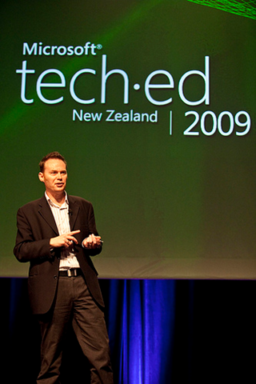

Last night I co-presented an [Intergen Twilight](http://www.intergen.co.nz/News-Events/Intergen-Events--Seminars/) at our Wellington office, talking to clients about [TechEd](http://www.msteched.com/newzealand/public/) this year. My partner in crime for the talk was Daniel Horwood who was the man behind the Hands on Labs at TechEd this year.

I think it went really well and we got a lot of good feedback talking to customers after the presentation.

Download the slides of our talk [**here**](/Media/Default/downloads/blog/Teched%20in%20a%20nutshell.pptx) (30megs).

