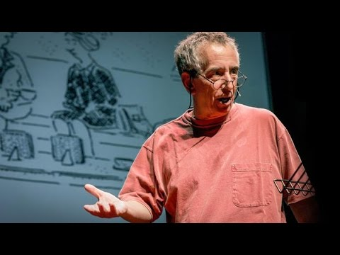

I haven't read [The Paradox of Choice](http://www.amazon.com/gp/product/0060005688?ie=UTF8&amp;tag=jamenewtking-20&amp;linkCode=as2&amp;camp=1789&amp;creative=9325&amp;creativeASIN=0060005688) but this talk by the author makes me want to.

Interesting!