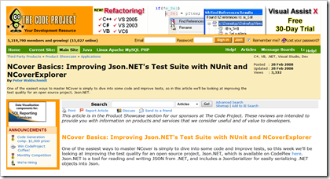
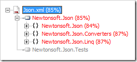

[Shawn](http://blog.obishawn.com/2008/06/why-you-should-have-100-code-test.html) writes that you should have 100% test code coverage, [Jason](http://www.ytechie.com/2008/06/unit-tests-are-for-functionality-not-code.html) agrees. [Tokes](http://andrewtokeley.net/archive/2008/06/14/unit-testing-paranoia.aspx), a [co-worker](http://www.intergen.co.nz/) and the person who pointed these posts out to me, [disagrees](http://andrewtokeley.net/archive/2008/06/14/unit-testing-paranoia.aspx).

I also disagree.

## Background

I'm a strong believer in unit testing. I have used unit testing in almost every project I have been involved in for a couple of years now and each time I find I get more and more value from using them.

My experience with code coverage tools is more limited. I first started looking at [NCover](http://www.ncover.com/) and code coverage after coming across an NCover article written its creator. The article used [Json.NET](http://www.newtonsoft.com/json), my own open source project, as the example! (if that doesn't prompt you to look at something nothing will 😃)

 

Near the end of the development cycle of Json.NET 2.0 NCover was of huge help identifying which methods and sections of code didn't have any tests running over them. Without NCover many of the bugs I found from eventually unit testing that code would still be in Json.NET.

## Coverage Percentage

While I think NCover is a great tool to identify what sections of code aren't being tested, the overall percentage mark that it gives is potentially dangerous.

Every software project has limited resources and spending your time chasing that number is a [poor use of it](http://en.wikipedia.org/wiki/Opportunity_cost). 100% coverage certainly doesn't mean that your program is bug free. Code that works with one input will break with another.

When it comes to unit testing I believe you are better off writing tests that focus on your use cases.

Obviously checking that the results are right is important but there is also making sure that your code behaves as expected when passed boundary values, performing inverse operations and cross checking results elsewhere in the application. These are all important things to test when creating robust code but aren't necessary to achieve 100% coverage.

## A Good Number

So what is a good number? If you have written tests the cover the possible uses of your application given the [time available](http://en.wikipedia.org/wiki/Scarcity) (NCover is useful for double checking that you are testing everything you want to) and have then have verified that the results are correct, whatever number your code coverage is at that moment is in my opinion a good number.

Json.NET's was 85%

