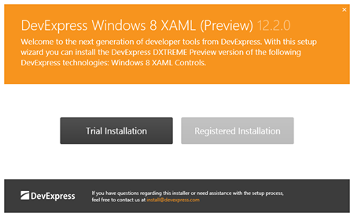
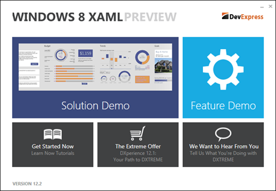
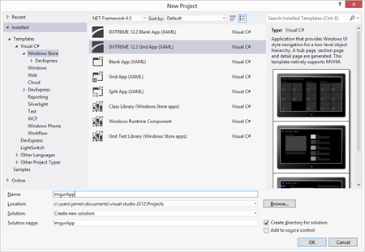
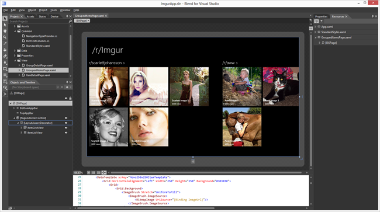
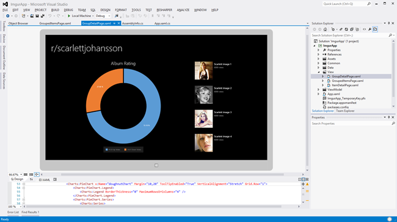

## XAML Applications on Windows 8 with DXTREME

The public release date of Windows 8 is rapidly approaching and with it comes a brand new way to build and sell Windows applications via the new [Windows Store](http://en.wikipedia.org/wiki/Windows_Store).

I first used the new Windows Store platform earlier this year when I ported my open source [Json.NET](http://www.newtonsoft.com/json) library to it, and since then I have also built a couple Windows applications on it using JavaScript. In this blog post I am trying out something new to me for the first time: Windows 8 development using .NET and XAML with [DXTREME's XAML controls](http://www.devexpress.com/Subscriptions/DXTREME/).

## Installation and first impressions

The first thing you'll notice after downloading DXTREME is its installer. The design is simple and to the point, and it looks completely at home in the Windows 8 UI.



After installation is complete you are presented with a dialog that serves as a hub to developers getting started with DXTREME. The dialog links to two Visual Studio solutions: a demo application that shows off the Windows 8 XAML controls that come with the library, and a solution application that shows the controls used together in a great looking professionally designed Windows 8 app.



As someone completely new to DXTREME and Windows 8 XAML development I found both of these applications and their source code to be great resources when building my first Windows Store XAML app. Especially useful was a feature of the demo application that lets you view the source code for a control while the demo is running.

## Getting Started

I find the best way to learn something new is to make something with it. The Windows 8 application I'm going to step through making in this blog post is called **/r/Imgur** and is an app that integrates the popular social websites [Reddit](http://www.reddit.com/) and [Imgur](http://imgur.com/). It displays images from those websites within a Windows application. (a link to the final source code will be at the end of the blog post)



As part of its installation DXTREME adds new Windows 8 project types to Visual Studio 2012. I used the DXTREME Grid Application project which sets up a basic Windows 8 tile based UI for you using DXTREME's new controls.

## Fetching Data from Imgur

The application's data and images are driven from Imgur, an Internet image hosting service. They provide a [simple API](http://api.imgur.com/) for getting album information as JSON for their website.

```csharp
public static async Task<Album> LoadAlbum(string subReddit)
{
    Album album = new Album();
    album.Title = subReddit;

    HttpClient httpClient = new HttpClient();
    string json = await httpClient.GetStringAsync("http://imgur.com" + subReddit + "/top.json");

    JObject o = JObject.Parse(json);
    foreach (JToken i in o["data"])
    {
        Image image = i.ToObject<Image>();
        image.Album = album;
        image.ImageUrl = string.Format("http://i.imgur.com/{0}.jpg", image.Hash);

        album.Items.Add(image);
    }

    return album;
}
```

The code above utilizes the Web API Client library and Json.NET. It simply gets the album data as JSON and deserializes it to an Album object. These albums and their images are what the UI databinds to.

## Styling the UI

Two of XAML's most powerful features are its support for the model-view-view-model pattern (MVVM) and design time view data, both of which have great support in DXTREME. Once setup design time view data lets you style your Windows 8 application from within Visual Studio 2012 or Expression Blend against pretend data. You no longer need to constantly restart your application to see what the final result will be because it is instantly visible in the XAML designer. It's a great timesaver.



The screenshot above is **/r/Imgur** in Expression Blend after I have finished styling it. The controls are being databound to hardcoded view model of Albums that I have created so that the look of the final application is visible in the Blend and Visual Studio designers without having to call off to the Imgur API.

## Adding New Albums

As well as displaying some pre-set albums in the app we want to give users the ability to add new albums. To do this we'll add a Windows 8 appbar button that will launch a Windows 8 style dialog with fields for the user to enter the new album name. Fortunately DXTREME has a Windows 8 style dialog that is perfect for the task.

```csharp
<Page.Resources>
    <DataTemplatex:Key="AddAlbumTemplate">
        <Grid>
            <Grid.ColumnDefinitions>
                <ColumnDefinitionWidth="Auto" />
                <ColumnDefinition />
            </Grid.ColumnDefinitions>
            <TextBlockText="/r/"FontSize="18"VerticalAlignment="Center" />
            <TextBoxGrid.Column="1"Text="{Binding Path=Title, Mode=TwoWay}"BorderThickness="1"BorderBrush="#FF3D3D3D"Margin="5 0 0 0" />
        </Grid>
    </DataTemplate>
</Page.Resources>
<dxcore:Interaction.Behaviors>
    <dxcore:ServiceContainerBehaviorServicesClient="{Binding}">
        <dxcore:DialogServiceKey="addDialog"ContentTemplate="{StaticResource AddAlbumTemplate}"Buttons="OKCancel"DefaultDialogButton="OK"CancelDialogButton="Cancel"Title="Add Reddit Album"/>
    </dxcore:ServiceContainerBehavior>
</dxcore:Interaction.Behaviors>
```

Wiring up a DialogService to a DataTemplate using the code above lets you launch a dialog without having to worry about recreating the look and feel of a Windows 8 dialog; that's all handled for you by the dialog control.

## Album Rating

The final piece to the application is to add the album rating to its detail page. Here we'll add a pie graph using DXTREME's graphing library to display the ratio of user up votes to down votes for the album.



The look and behaviour of the pie graph is defined in XAML, allowing us to design it inside the Visual Studio XAML designer without running the application, and then the up and down votes for the album are databound the graph when the application executed at runtime.

## Wrapping Up

I found the controls I used while making **/r/Imgur** well thought out and easy to use. One important feature I always look for in controls and libraries when using XAML is how well they work with the rest of the framework. Everything has great MVVM support and the controls included in the library provide a nice experience to work with the Visual Studio 2012 and Expression Blend designers.

**[Click here to download the /r/Imgur application source code](../../public/xaml-applications-on-windows-8-with-dxtreme/imgurapp.zip)**

*Disclosure of Material Connection: I received one or more of the products or services mentioned above for free in the hope that I would mention it on my blog. Regardless, I only recommend products or services I use personally and believe my readers will enjoy. I am disclosing this in accordance with the Federal Trade Commission's 16 CFR, Part 255:* [*Guides Concerning the Use of Endorsements and Testimonials in Advertising.*](http://www.access.gpo.gov/nara/cfr/waisidx_03/16cfr255_03.html)